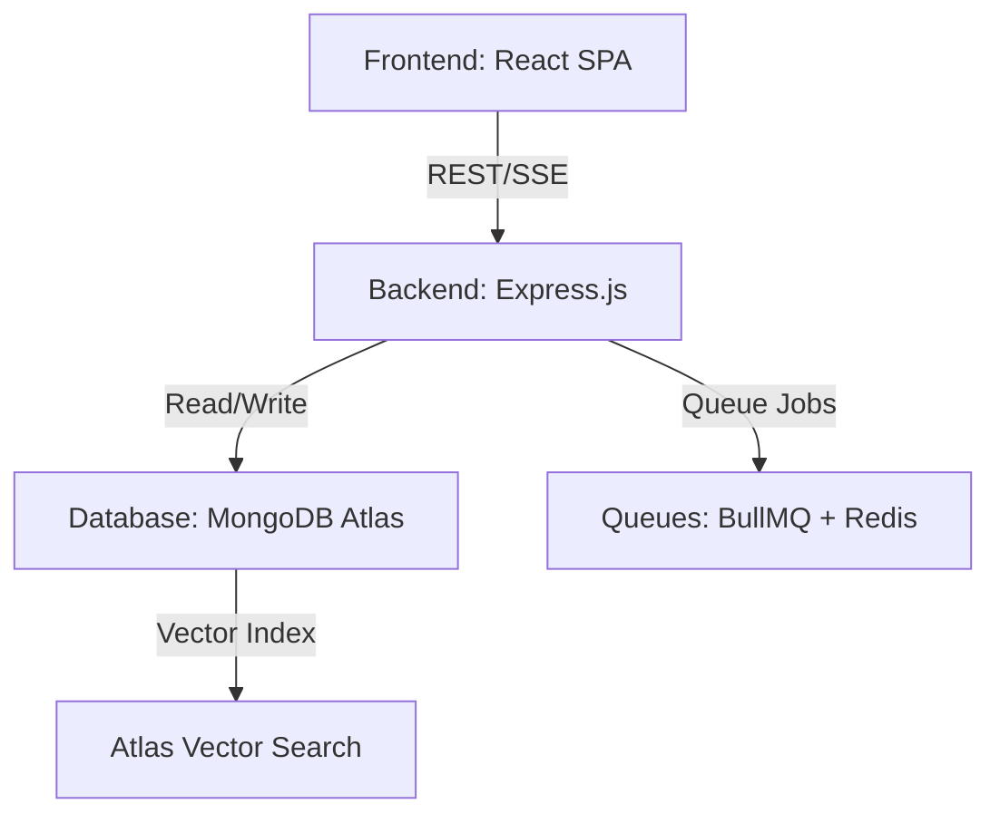

# System Architecture Document
## JCCAD Company Intelligence Platform (CIP)

**Prepared by the Architecture Review Board**

| Version | Date | Status | Target Audience |
| :--- | :--- | :--- | :--- |
| v1.0.0 | 2026-06-30 | Released | Engineering Leadership, Architecture Review Board, Tech Leads |

---

## SECTION 1: Overall System Architecture

The JCCAD Company Intelligence Platform (CIP) is designed as a highly decoupled, service-oriented system consisting of an asynchronous, event-driven backend and a micro-frontends ready SPA container. 

```
                                  +---------------------------------------+
                                  |         CDN / Edge Proxy (Cloudflare) |
                                  +---------------------------------------+
                                                     |
                                                     v
                                  +---------------------------------------+
                                  |         React Chat SPA / Admin Portal |
                                  +---------------------------------------+
                                                     |
                                                     | HTTPS / WSS / SSE
                                                     v
                                  +---------------------------------------+
                                  |        Nginx Ingress / API Gateway    |
                                  +---------------------------------------+
                                      |              |                |
                +---------------------+              |                +---------------------+
                |                                    |                                      |
                v                                    v                                      v
+-----------------------------+       +-----------------------------+        +-----------------------------+
|    Auth Service (OAuth/JWT) |       |      Core API Service       |        |   Job Worker (Queue Consumers)|
+-----------------------------+       +-----------------------------+        +-----------------------------+
                |                                    |                                      |
                v                                    |                                      v
+-----------------------------+                      |                       +-----------------------------+
|     JCCAD SSO / LDAP        |                      |                       |    Crawler / Parser Engine  |
+-----------------------------+                      |                       +-----------------------------+
                                                     |                                      |
                        +----------------------------+-----------------------+              |
                        |                            |                       |              |
                        v                            v                       v              v
         +----------------------------+   +----------------------+   +------------------------------+
         | MongoDB Atlas (SQL/Vector) |   | Redis (Cache/Queue)  |   | S3-Compatible Object Store  |
         +----------------------------+   +----------------------+   +------------------------------+
                        |                            |
                        v                            v
         +---------------------------------------------------------------+
         |                  Foundation Model APIs                        |
         |         (OpenAI text-embedding-3 / gpt-4o / Cohere)            |
         +---------------------------------------------------------------+
```

* **Frontend:** A React-based Single Page Application (SPA), deployed to an edge CDN (Cloudflare), optimizing first contentful paint (FCP) and serving a responsive client layout.
* **Backend:** A Node.js microservice architecture built with Express.js. The Core API manages transactional REST endpoints, SSE streams, and business logic. A worker layer processes asynchronous tasks (crawling, parsing, embedding) via a Redis queue.
* **Authentication:** Integrates JCCAD Directory Services (LDAP/AD) via an OAuth2/OIDC gateway layer, issuing signed JWT tokens in HTTP-only cookies.
* **AI Layer:** Manages interaction with LLMs, orchestrating dynamic prompting, semantic chunking, and vision evaluations.
* **Document Processing:** A containerized worker utilizing open-source libraries to convert PDFs, DOCX, and PPTX files into clean Markdown content.
* **Knowledge Base:** Managed via a unified database instance, providing soft-delete capabilities, lifecycle tracking, and approval transitions.
* **Vector Search:** Handled natively using **MongoDB Atlas Vector Search**, combining semantic vector embeddings with traditional lexical queries.
* **Analytics:** Event stream loggers collect interaction payloads asynchronously and pipe them to aggregators.
* **Monitoring & Observability:** Telemetry exposed via a Prometheus exporter scraped by Grafana, alongside centralized logging pipelines.
* **Storage:** Relational entities and chunks stored in MongoDB, raw binaries stored in an S3-compatible Object Storage server (e.g., MinIO or AWS S3).
* **Deployment:** Distributed on Kubernetes clusters (EKS/GKE) across multi-availability zones.

---

## SECTION 2: Component Diagram

| Component Name | Responsibilities | Key Inputs | Key Outputs | Key Dependencies | Primary Failure Scenarios & Mitigations |
| :--- | :--- | :--- | :--- | :--- | :--- |
| **API Gateway** | Route validation, SSL termination, global rate limiting, CORS configuration. | Client HTTPS requests. | Routed backend payloads. | Ingress controllers. | *Failure:* Gateway overflow under traffic spike. *Mitigation:* Edge rate-limiting at CDN tier + auto-scaling rules. |
| **Auth Service** | Token issuance, signature checks, LDAP directory authentication sync. | Login credentials, SSO codes. | Cryptographically signed JWTs. | JCCAD LDAP, Redis. | *Failure:* LDAP lookup timeout. *Mitigation:* Cache active LDAP profiles in Redis with 1-hour sliding expiration. |
| **Core Chat API** | Session logic, Dynamic system prompt generation, SSE token streaming. | Chat messages, session tokens. | Real-time SSE token stream. | MongoDB, Redis, OpenAI APIs. | *Failure:* OpenAI API latency spike. *Mitigation:* Fall back to Anthropic Claude or a local Llama-3 instance. |
| **Ingestion Worker** | Asynchronous document parsing, layout extraction, layout validation. | Object storage references. | Chunked markdown payloads. | Redis (bullmq), Object Storage. | *Failure:* Parsing script crashes on corrupt PDF. *Mitigation:* Worker sandboxing + database state updated to `FAILED` with retry limits. |
| **Embedder Service** | Batch embedding generation, vector validation. | Clean markdown chunks. | 1536-dim vector arrays. | OpenAI Embedding API. | *Failure:* Embedding API quota exceeded. *Mitigation:* Queue embeddings in Redis and apply exponential backoff. |
| **Web Crawler** | Targeted HTTP scraping, HTML DOM cleanup. | Seed URLs, crawl bounds. | Raw text/HTML objects. | Target host servers. | *Failure:* Host crawler IP banned. *Mitigation:* Randomize crawler delay + rotate proxies. |
| **Database System**| Transactional schemas, analytics events, Vector Search indexes. | Write queries, search inputs. | Query response arrays. | MongoDB Atlas. | *Failure:* Database primary node fails. *Mitigation:* 3-node replica set with automatic primary election. |

---

## SECTION 3: Application Layers

CIP enforces strict Layered Architecture principles using feature-first directory structures:

```
+-----------------------------------------------------------------------+
|  Presentation Layer (React Chat UI, Admin Views, Component Libraries) |
+-----------------------------------------------------------------------+
                                  |
                                  v
+-----------------------------------------------------------------------+
|  Application Layer (Use Cases, Auth Middlewares, System Orchestrators)|
+-----------------------------------------------------------------------+
                                  |
                                  v
+-----------------------------------------------------------------------+
|  Domain Layer (Entities, Domain Rules, Context Router Logic)          |
+-----------------------------------------------------------------------+
                                  |
                                  v
+-----------------------------------------------------------------------+
|  Infrastructure Layer (Atlas Search Repos, S3 Adapters, Logger Adapts)|
+-----------------------------------------------------------------------+
```

* **Presentation Layer:** Executes only in the client browser. Focuses on UI state validation, accessibility styling (ARIA), and real-time streaming updates.
* **Application Layer:** Acts as the orchestrator. Maps API parameters to domain entities, manages transaction boundaries, and coordinates asynchronous jobs.
* **Domain Layer:** Contains the pure business logic of JCCAD (e.g., dynamic prompt compilation rules, context routing thresholds, access permission matches). It has zero dependencies on frameworks or databases.
* **Infrastructure Layer:** Implements interfaces defined in the domain/application layers. Houses data storage connections, model API integrations, and system-level file parsers.

---

## SECTION 4: Frontend Architecture

The frontend is designed as a React SPA structured around a **Feature-Based (Feature-First)** layout:

```
src/
├── assets/             # Fonts, global stylesheets
├── components/         # Reusable presentation components (Buttons, Input, Modals)
├── context/            # Global context providers (Theme, Auth, Language)
├── features/           # Feature modules
│   ├── chat/           # Chat window, messages, stream logic
│   ├── knowledge/      # Knowledge table, upload actions
│   └── analytics/      # Chart dashboards, metrics displays
├── hooks/              # Global custom hooks (useAuth, useLocalStorage)
├── services/           # Backend API clients (Axios wrappers, EventSource)
├── utils/              # Formatting helpers, constants
└── App.tsx             # Application container
```

* **State Management:** Uses React Context + hooks for global state (Auth status, Theme, User profile), and **Zustand** for high-frequency state updates (e.g., managing the active message streaming arrays to prevent unnecessary re-renders).
* **Routing:** Implements **React Router v6** with declarative protected route guards based on user authorization tags.
* **Reusable Component Strategy:** Styled using vanilla CSS variables, establishing absolute compatibility with light, dark, and high-contrast accessibility themes.
* **Error Boundaries:** Feature components are wrapped inside React Error Boundaries, catching runtime render failures and displaying localized fallback prompts without crashing the main application viewport.
* **Streaming UI Rendering:** Stream tokens are appended to state arrays using a custom hook consuming browser `EventSource` wrappers.
* **dark Mode Readiness:** Configured globally using theme variables in the base stylesheet:
  ```css
  :root { --bg-primary: #ffffff; --text-color: #1e1e1e; }
  [data-theme="dark"] { --bg-primary: #121212; --text-color: #f5f5f5; }
  ```
* **Accessibility & I18n:** Renders layout content dynamically based on translation assets mapped using JSON language configurations.

---

## SECTION 5: Backend Architecture

Built using Node.js (TypeScript) and Express.js, organized around clean controller-service-repository patterns.

```
server/
├── config/             # Global configurations, environments, key loads
├── controllers/        # Express request routing, status transformations
├── middlewares/        # JWT parsing, RBAC tags, rate limits, PII scrubbers
├── services/           # Business logic, RAG pipelines, prompt compilation
├── repositories/       # Database access, MongoDB queries
├── workers/            # BullMQ processing workers (Parsing, Embeddings)
└── app.ts              # Express application configuration
```

* **Middleware Pipeline:** Every request undergoes pipeline evaluation:
  1. *Security Check:* Rate limiter, CORS mapping, Content Security Policies.
  2. *Authentication:* JWT token verification from HttpOnly cookies.
  3. *Authorization:* RBAC tag evaluation against target route maps.
  4. *PII Scrubbing:* Pre-processing input parameters to mask sensitive patterns.
* **Asynchronous Execution:** Express handles requests asynchronously, returning immediate task tokens. BullMQ workers process parsing and embedding steps in the background, utilizing Redis as a task queue to prevent API gateway resource blocking.

---

## SECTION 6: Database Architecture

MongoDB Atlas is the primary database, housing operational tables, analytics logs, and vector indexes.

```
                                  +-----------------------+
                                  |         Users         |
                                  +-----------------------+
                                              | 1
                                              |
                                              | N
                                  +-----------------------+
                                  |     Chat_Sessions     |
                                  +-----------------------+
                                              | 1
                                              |
                                              | N
                                  +-----------------------+
                                  |       Messages        |
                                  +-----------------------+
                                     | 1            | 1
                                     |              |
                                     | N            | 1
                        +-----------------+    +------------------+
                        |    Citations    |    |     Feedback     |
                        +-----------------+    +------------------+
```

### MongoDB Collections Schema

#### 1. `users`
```json
{
  "_id": "ObjectId",
  "email": "string",
  "password_hash": "string",
  "role": "string (Super_Admin|Admin|Manager|Employee|Professional|Student)",
  "mfa_secret": "string",
  "created_at": "ISODate",
  "last_login": "ISODate"
}
```
* *Indexes:* `{"email": 1}` (Unique).

#### 2. `chat_sessions`
```json
{
  "_id": "ObjectId",
  "user_id": "ObjectId (nullable)",
  "session_token": "string",
  "started_at": "ISODate",
  "last_activity": "ISODate",
  "status": "string (active|archived|deleted)"
}
```
* *Indexes:* `{"session_token": 1}`, `{"user_id": 1}`.

#### 3. `messages`
```json
{
  "_id": "ObjectId",
  "session_id": "ObjectId",
  "sender": "string (user|assistant|system)",
  "mode": "string (expert|general)",
  "text": "string",
  "timestamp": "ISODate"
}
```
* *Indexes:* `{"session_id": 1, "timestamp": 1}`.

#### 4. `feedback`
```json
{
  "_id": "ObjectId",
  "message_id": "ObjectId",
  "rating": "string (up|down)",
  "reason": "string (nullable)",
  "comment": "string (nullable)",
  "created_at": "ISODate"
}
```
* *Indexes:* `{"message_id": 1}`.

#### 5. `documents`
```json
{
  "_id": "ObjectId",
  "filename": "string",
  "file_hash": "string",
  "storage_path": "string",
  "mime_type": "string",
  "size_bytes": "int",
  "role_access": "array (strings)",
  "status": "string (processing|indexed|failed)",
  "error_log": "string (nullable)",
  "created_at": "ISODate"
}
```
* *Indexes:* `{"file_hash": 1}`.

### Backup, Recovery & Lifecycle policies
* **Data Lifecycle:** Analytics events undergo automated archiving after 90 days, moving to low-cost S3 Glacier vaults. Soft-deleted documents trigger secondary queues that purge associated vector collections.
* **Backups:** Atlas Continuous Cloud Backups execute hourly snapshot saves across multi-region replica groups.

---

## SECTION 7: Vector Database Architecture

We implement **MongoDB Atlas Vector Search** for semantic indexing and vector similarity search.

```
                    +------------------------------------+
                    |   Source Document (PDF/DOCX/PPTX)  |
                    +------------------------------------+
                                       |
                                       v
                    +------------------------------------+
                    |  Recursive Split: 512-Token Chunks |
                    +------------------------------------+
                                       |
                                       v
                    +------------------------------------+
                    |     OpenAI text-embedding-3        |
                    +------------------------------------+
                                       |
                                       v
                    +------------------------------------+
                    |    Vector Document Store Collection|
                    |     - chunk_text (String)          |
                    |     - embedding (1536-dim Float)   |
                    |     - metadata (JSON Map)          |
                    +------------------------------------+
```

### Index Configuration (JSON schema)
```json
{
  "mappings": {
    "dynamic": true,
    "fields": {
      "embedding": {
        "dimensions": 1536,
        "similarity": "cosine",
        "type": "knnVector"
      },
      "role_access": {
        "type": "token"
      }
    }
  }
}
```

### Retrieval & Ranking Strategy
1. **Query Embeddings:** Generate vectors for incoming user queries.
2. **K-NN Retrieval:** Execute k-NN vector matching, filtering by user authorization roles:
   ```javascript
   {
     $vectorSearch: {
       index: "vector_index",
       path: "embedding",
       queryVector: queryEmbeddings,
       numCandidates: 100,
       limit: 10,
       filter: { role_access: { $in: userRoles } }
     }
   }
   ```
3. **Lexical Retrieval:** Run full-text search index matching (BM25 Equivalent) in parallel.
4. **Fusion & Reranking:** Combine search results using Reciprocal Rank Fusion (RRF). Pass the combined candidates to the Cohere Rerank API to select the top 4 chunks for prompt construction.

---

## SECTION 8: AI Architecture

Orchestrates conversational context generation, intent routing, and brand alignment.

```
                    +------------------------------------+
                    |             User Query             |
                    +------------------------------------+
                                       |
                                       v
                    +------------------------------------+
                    |      Automatic Mode Selector       |
                    +------------------------------------+
                                       |
                     +-----------------+-----------------+
                     | >= 0.70                           | < 0.70
                     v                                   v
        +--------------------------+       +---------------------------+
        |   Company Expert Mode    |       |      General AI Mode      |
        +--------------------------+       +---------------------------+
                     |                                   |
                     v                                   v
        +--------------------------+       +---------------------------+
        |  1. Generate Query Vector|       | 1. Bypasses Vector search |
        |  2. Retrieve RAG chunks  |       | 2. Standard System Prompt |
        |  3. Run Reranker (Top 4) |       | 3. Set temperature to 0.7 |
        |  4. Strict grounding     |       |                           |
        |  5. Set temperature 0.0  |       |                           |
        +--------------------------+       +---------------------------+
                     |                                   |
                     +-----------------+-----------------+
                                       |
                                       v
                    +------------------------------------+
                    |         LLM Engine Stream          |
                    +------------------------------------+
```

* **Prompt Builder:** Dynamically compiles the system prompt instructions based on active JCCAD configuration metadata (Domains, services, support emails).
* **Conversation Memory Manager:** Restores past session messages from MongoDB, pruning long histories to fit within safe context limits.
* **Source Citations Engine:** Matches generated text sentences against RAG context blocks. Inserts inline citation numbers matching source file structures.
* **Hallucination Reducer:** Enforces temperature `0.0` and injects negative constraints in system prompts: *"Do not extrapolate beyond the provided text. State you do not know if information is absent."*
* **Image Understanding Gateway:** Processes drawing files using multimodal models (`gpt-4o`). Generates text summaries and layout evaluations before passing them to the main context.

---

## SECTION 9: Knowledge Architecture

Manages the lifecycle, synchronization, and verification of JCCAD's knowledge base assets.

```
+---------------+     +---------------+     +---------------+     +---------------+
| Upload File   | --> | Clean Text    | --> | Create Chunks | --> | Generate      |
| (Admin Panel) |     | & Parsers     |     | (Token-based) |     | Embeddings    |
+---------------+     +---------------+     +---------------+     +---------------+
                                                                          |
                                                                          v
+---------------+     +---------------+     +---------------+     +---------------+
| Update Chatbot| <-- | Index Vectors | <-- | Verify Access | <-- | Save Chunk    |
| Config        |     | (Atlas Index) |     | Tags & Status |     | & Embeddings  |
+---------------+     +---------------+     +---------------+     +---------------+
```

### Knowledge Categories & Document Partitioning
* **Company Profile (JSON):** Contains active domains, services, and locations. Updates compiled prompts dynamically without rebuilding index components.
* **Corporate Policies (PDF/DOCX):** Internal operations guides and guidelines. Accessed only by Employee and Manager roles.
* **FAQs (Structured Collection):** Direct matching Q&A lists used to quickly resolve common inquiries.
* **Website Pages (Cleaned Markdown):** Syncs with crawled content, matching public website updates.

### Version Control & Approval Workflow
* Ingested documents default to a `PENDING_REVIEW` state.
* Managers review parsed structures. Approving updates changes document status to `ACTIVE`, triggering vector generation and system index synchronization.

---

## SECTION 10: Website Crawling Architecture

The crawler keeps the chatbot updated with public website information.

```
                    +------------------------------------+
                    |           Cron Trigger             |
                    +------------------------------------+
                                       |
                                       v
                    +------------------------------------+
                    |      Crawler Worker Instance       |
                    +------------------------------------+
                                       |
                     +-----------------+-----------------+
                     |                                   |
                     v                                   v
        +--------------------------+       +---------------------------+
        | 1. Respects robots.txt   |       | 1. DOM Stripper           |
        | 2. Rate Limit (1s delay) |       | 2. Markdown Converter     |
        | 3. Limit Depth (Max 3)   |       | 3. Check hash differences |
        +--------------------------+       +---------------------------+
                                                         |
                                                         v
                                           +---------------------------+
                                           | Compute embedding updates |
                                           | and reload Index          |
                                           +---------------------------+
```

* **Rate Limiting & Politeness:** Enforces a 1000ms delay between fetches. Checks `robots.txt` before parsing.
* **HTML Cleaning:** Strips header elements, footers, scripts, and stylesheets, extracting clean markdown text structures.
* **Change Detection:** Computes SHA256 hashes of crawled web pages. Updates vector indices only if page hashes differ from database values.

---

## SECTION 11: Security Architecture

Enforces defense-in-depth principles across every infrastructure layer.

* **Authentication:** Multi-factor authentication (MFA) required for Admin roles. Authenticates users using OIDC SSO configurations.
* **Authorization:** Backend middleware validates RBAC mappings on every route:
  ```javascript
  const checkRole = (roles) => (req, res, next) => {
    if (!roles.includes(req.user.role)) return res.sendStatus(403);
    next();
  };
  ```
* **Encryption:** TLS 1.3 enforced for data in transit. Enforce transparent data encryption (TDE) for databases and object storage buckets using AES-256.
* **Secrets Management:** Environment secrets and API keys are stored in Vault solutions (e.g., HashiCorp Vault or AWS Secrets Manager) instead of source code repositories.
* **Prompt Injection Protection:** Input sanitization layer runs user inputs through guardrail models to block system override commands.
* **File Validation:** Restricts uploads to whitelisted file extensions. Files are scanned with anti-virus scanners (ClamAV) within isolated parser containers.

---

## SECTION 12: Analytics Architecture

Asynchronously captures interactions, calculating performance and usage metrics.

```
Client UI Feedback / API Latency Logs
   |
   v
Asynchronous Event Bus (Redis Streams / BullMQ)
   |
   v
Analytics Aggregation Engine (Node Background Queue Worker)
   |
   v
MongoDB Analytics Collection (Aggregated Time-series)
   |
   v
Admin Dashboard Visualization Panels (Recharts UI)
```

* **Chat Analytics:** Tracks session volumes, average messages per session, and fallback response rates.
* **Usage Analytics:** Monitors token consumption, database search counts, and system operating costs.
* **Knowledge Analytics:** Tracks vector database updates, crawler cycles, and document processing durations.
* **User Satisfaction Analytics:** Logs thumbs-up/down rates and reviews comments.
* **Failed Questions Analytics:** Stores queries that returned fallback responses to identify gaps in the knowledge base.

---

## SECTION 13: Scalability

The system handles scaling across user load tiers through modular design decisions:

| Concurrent Users | System Bottlenecks | Architectural Scaling Response Strategy |
| :--- | :--- | :--- |
| **10 to 100** | None. Single application server handles load easily. | Deploy backend services in single container instances. Run database replicas locally. |
| **10,000** | API Gateway capacity limits, MongoDB resource usage spikes. | Enable horizontal auto-scaling (HPA) for API gateways. Cache database query results in Redis. |
| **100,000** | MongoDB lock contentions, OpenAI API rate limits. | Split databases, using read replicas. Set up fallback model endpoints. |
| **1 Million** | Vector search latency spikes, queue congestion. | Implement sharding on MongoDB collections. Scale worker containers horizontally. |

---

## SECTION 14: Deployment Architecture

The multi-environment pipeline manages deployment lifecycles from testing to production.

```
[Development Branch] --> [CI: Run Unit Tests & Linter] --> [Deploy to Test K8s Namespace]
                                                                      |
[Staging Release]    --> [CI: Run Integration Tests]   --> [Deploy to Staging Namespace]
                                                                      |
[Production Tag]     --> [Deploy to Prod Namespace]     --> [Verify via Smoke Tests]
```

* **Infrastructure as Code (IaC):** Environments are defined using **Terraform** to ensure configuration consistency.
* **CI/CD:** Pipelines verify builds, run security vulnerability scans, package containers, and deploy to Kubernetes namespaces.
* **Environment Configuration:** Configuration variables are read from system environments, keeping database credentials and API secrets in secrets managers.

---

## SECTION 15: Observability

Telemetry pipelines capture system status to support SRE incident response workflows.

* **Metrics:** Exposes system metrics (CPU, RAM, API latencies) at `/metrics` for scraping by Prometheus.
* **Logs:** Generates JSON log formats streamed to centralized log aggregators (e.g., Loki or Elasticsearch).
* **Tracing:** Uses **OpenTelemetry** to trace requests across the API Gateway, Core API, and database services.
* **Alerting:** Configures alerts in Prometheus Alertmanager to notify teams of critical failures (e.g., API latency $> 2$s or error rates $> 5\%$).

---

## SECTION 16: Technology Decisions



### Technical Evaluation Matrix

| Domain | Recommended Technology | Alternatives | Architectural Justification & Trade-offs |
| :--- | :--- | :--- | :--- |
| **Frontend Framework** | **React.js** | Vue, Angular, Next.js | Provides rich ecosystem support for state management, component reuse, and clean styling. *Trade-off:* Requires client-side rendering compilation, but this is mitigated by hosting files on CDNs. |
| **Backend Engine** | **Express.js (Node.js)** | Python FastAPI, NestJS | Fast execution, asynchronous I/O loops, and compatibility with streaming APIs (SSE). *Trade-off:* Python is better for direct data science tasks, but our ML tasks are handled via remote API endpoints. |
| **Main Database** | **MongoDB Atlas** | PostgreSQL | Handles dynamic schemas (Company Profile JSON) and conversational logs efficiently. Atlas Vector Search handles vector vectors natively, simplifying our stack. *Trade-off:* Does not support traditional SQL foreign key constraints. |
| **Job Queue** | **BullMQ (Redis)** | RabbitMQ, Celery | High-performance asynchronous queue management with minimal infrastructure footprint. *Trade-off:* Memory-based queues, requiring persistent backup storage configurations for Redis. |

---

## SECTION 17: Architecture Decision Records (ADR)

### ADR-01: Choice of Unified Database & Vector Store (MongoDB Atlas)
* **Context:** The platform requires storing structured relational entities (Users, Messages) alongside dynamic documents (Company Profile JSON) and high-dimensional vector embeddings (1536-dim).
* **Decision:** We select MongoDB Atlas to handle both transactional relational data and vector embeddings (via Atlas Vector Search).
* **Consequences:** Eliminates the need to maintain separate database and vector index instances, ensuring consistent data backups, ACID transactional security, and reducing operational overhead.

### ADR-02: Local Semantic Query Routing (BGE-M3 on API Gateway)
* **Context:** The platform must route queries between Expert and General AI modes, keeping latency under 50ms without incurring external API costs.
* **Decision:** Run a local intent classifier (BGE-M3) on the API Gateway.
* **Consequences:** Reduces routing latencies to under 30ms, eliminates external network calls, and protects system APIs from rate-limit failures.

---

## SECTION 18: Future Expansion

The system architecture is designed to support future expansions without requiring redesign:

* **Voice Support:** Audio streams can be routed to a STT (Speech-to-Text) worker, parsing inputs to text before passing them to the Core Chat API.
* **CRM & LMS Integrations:** External APIs can integrate by implementing standard interface contracts in the Application layer, keeping integration code decoupled from core business logic.
* **Multi-Tenant (SaaS) Readiness:** The database schema supports scaling to multi-tenant configurations by appending `company_id` partition keys to collections.

---
*(End of Architecture Document)*
