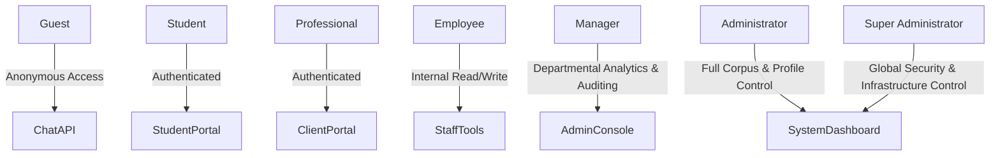
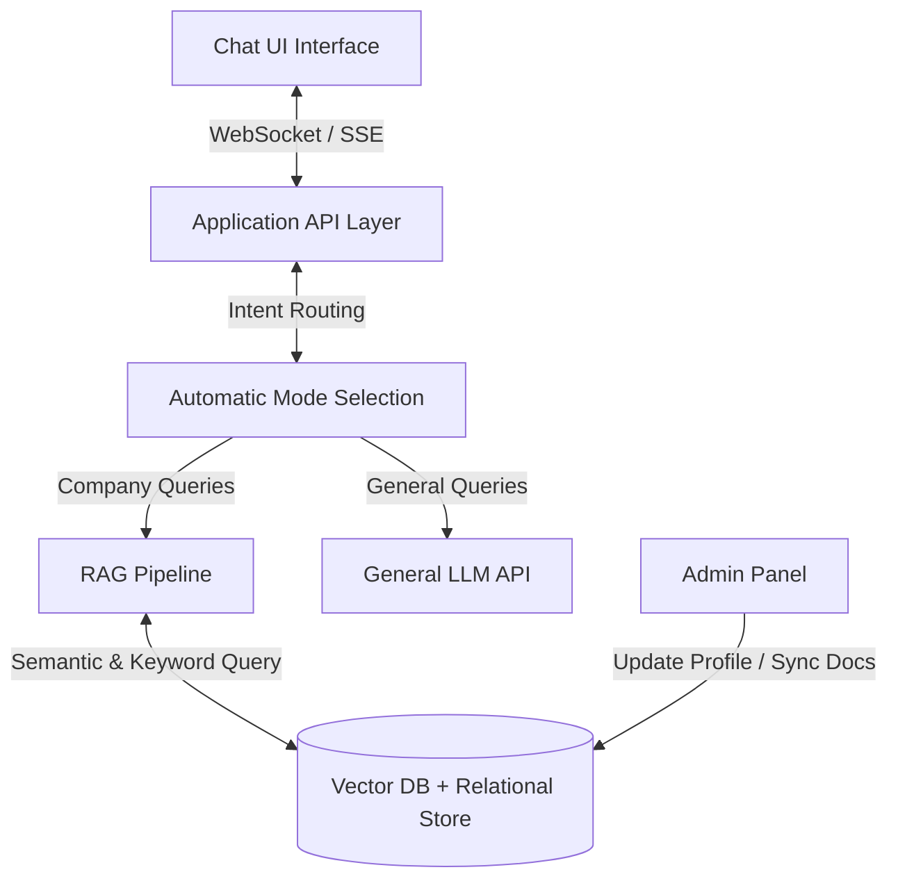
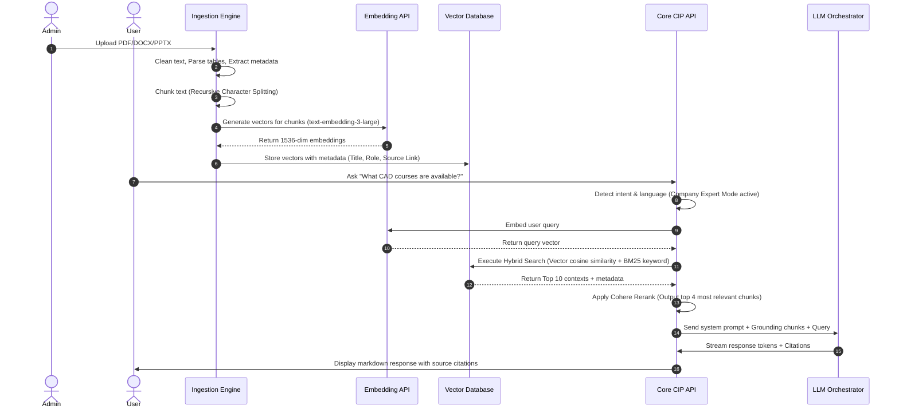
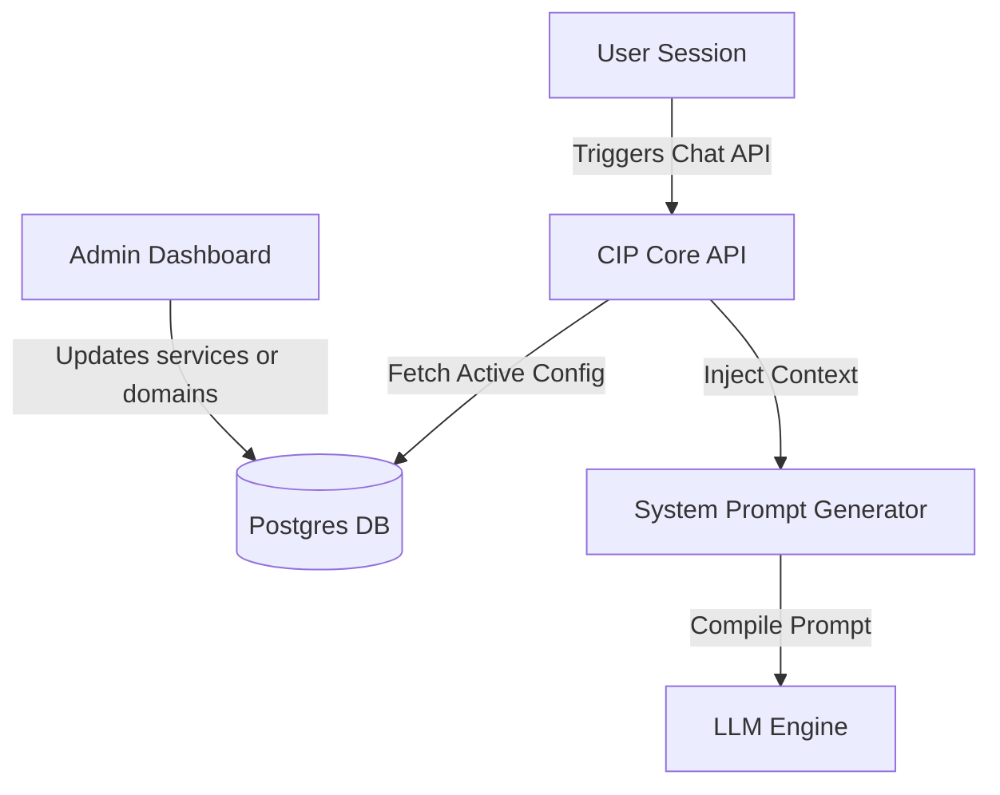
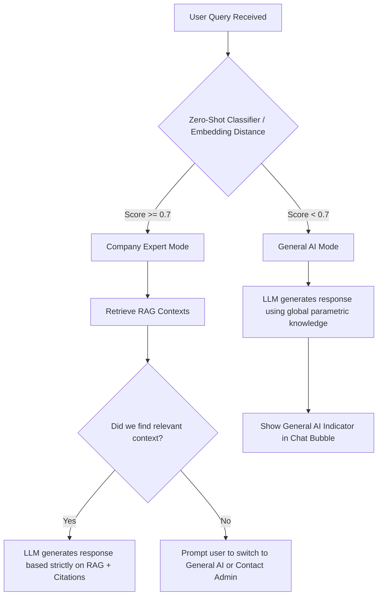
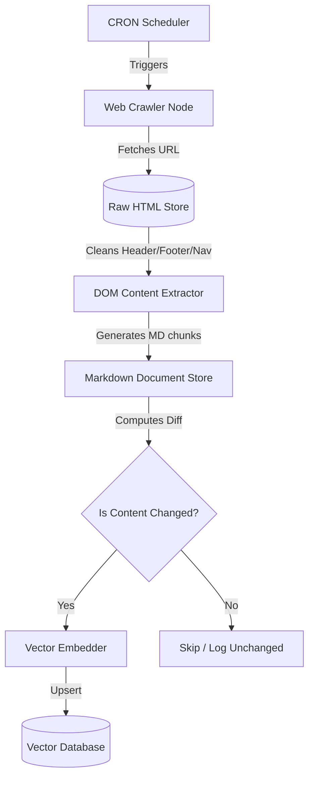
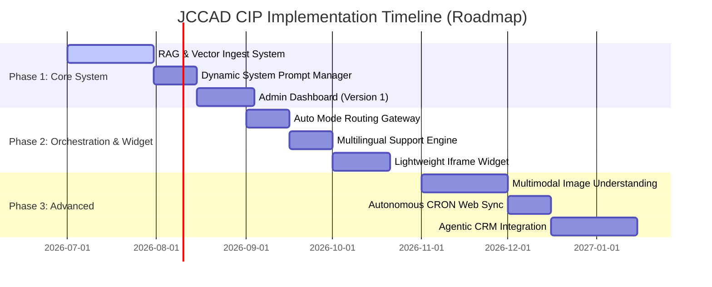

# Product Requirements Document (PRD)
## JCCAD Company Intelligence Platform (CIP)

| Document Version | Date | Authors | Status |
| :--- | :--- | :--- | :--- |
| v1.0.0 | 2026-06-30 | Principal PM, Enterprise Architect, Principal AI Engineer, Security Architect | Draft / Pending Review |

---

## 1. Executive Summary
The **JCCAD Company Intelligence Platform (CIP)** is an enterprise-grade AI chatbot platform designed to serve as the unified, official knowledge assistant for JCCAD (an Engineering and Technology Skill Development Hub). The platform will ingest JCCAD's structured and unstructured knowledge assets (documents, websites, training materials, and company profile info) and serve them via a natural language interface to two primary audiences: students looking for training and internships, and professionals seeking engineering design services, workshops, or UAV research collaborations.

CIP features a hybrid operational model, enabling automatic context routing between **Company Expert Mode** (RAG-driven retrieval over official company resources) and **General AI Mode** (using underlying Large Language Model capabilities for general engineering or programming queries). Crucially, the system is designed to be fully modular and scalable, with a decoupled admin dashboard allowing complete administrative control over the knowledge corpus, company profile, user access, and system analytics without requiring code modifications or application redeployment.

---

## 2. Problem Statement
JCCAD interacts with a high volume of inquiries from both students (inquiring about CAD training, workshops, mechatronics courses, and internships) and industry professionals (inquiring about UAV research, engineering design services, and software solutions). The current operational model suffers from several inefficiencies:
* **Information Silos:** Company knowledge is dispersed across static PDF training plans, word documents, internal mechatronics/UAV files, PowerPoint presentations, and legacy web pages.
* **Repetitive Support Overhead:** Operations and engineering staff spend significant time answering recurring questions regarding course details, eligibility criteria, internship schedules, and service capabilities.
* **Friction in Lead Conversion:** Potential clients and students experience delays in getting answers to specific, domain-specific queries, leading to lower engagement and lost opportunities.
* **Lack of Centralized Knowledge Control:** There is no single, auditable repository for "approved company truth" that can be updated in real-time. Changes to JCCAD’s course structures or engineering offerings require developer intervention to update on public channels.

---

## 3. Vision Statement
To establish the JCCAD Company Intelligence Platform (CIP) as the single, authoritative, intelligent gateway for all internal and external JCCAD interactions. By combining cutting-edge semantic search, document parsing pipelines, multimodal image understanding, and a sleek, responsive user interface, CIP will bridge the gap between engineering education and industry execution. It will transition from a standalone chatbot to an embeddable widget on the JCCAD official website, providing instant, multilingual, and accurate answers, thereby transforming how JCCAD converts inquiries into active enrollments and client projects.

---

## 4. Business Goals
* **Reduce Support Tickets:** Decrease repetitive inquiries received via email and contact forms by 40% within six months of deployment.
* **Increase Lead Generation:** Improve conversion of website visitors to course registrants and service clients by 25% through proactive follow-up suggestions and instant answers.
* **Maximize Operational Efficiency:** Eliminate developer overhead for company profile updates; administrators must be able to change service lists, domains, and training details in under 5 minutes via the dashboard.
* **Enhance Student Onboarding:** Provide students with a 24/7 autonomous learning assistant that explains JCCAD's core domains (Aeronautical, Automobile, Mechanical, Mechatronics) and helps them select courses/internships.
* **Ensure Information Accuracy:** Maintain a zero-hallucination rate for official company inquiries by enforcing strict grounding rules within the Retrieval-Augmented Generation (RAG) pipeline.

---

## 5. Project Scope
### In Scope
* **Intelligent Chat Interface:** Web-based chat application supporting streaming responses, suggested follow-up questions, source citations, and multimodal image understanding.
* **Automated Context Router:** Intent classifier that automatically determines if a query is JCCAD-specific (routing to Company Expert Mode) or general-purpose (routing to General AI Mode).
* **Ingestion Pipelines:** High-throughput document processors for PDF, DOCX, PPT files, and a targeted website crawler.
* **Admin and Analytics Portal:** Web dashboard for role-based user management, company profile updates (Version 1 parameters), document synchronization, chat logs, user feedback audits, and system health monitoring.
* **Embeddable Chat Widget:** A lightweight, secure JS widget designed for integration into the main JCCAD website.
* **RAG Pipeline & Semantic Store:** Vector database integration with hybrid keyword/semantic search, reranking, and citation generation.

---

## 6. Out of Scope
* **E-Commerce and Payment Gateways:** Direct payment processing for course enrollments or engineering services will not occur within the CIP chatbot; users will be redirected to existing JCCAD payment portals via structured markdown links.
* **Automated Code Execution Sandbox:** While the General AI mode can generate code, the platform will not compile or run user code within its infrastructure.
* **Direct Integration with Internal CAD software APIs:** The platform will not interface with running instances of SolidWorks, CATIA, or AutoCAD, although it will ingest documents containing CAD methodologies.
* **Third-Party Live Agent Takeover:** Integration with external customer service platforms (e.g., Zendesk, Intercom) is deferred to Phase 2.

---

## 7. User Personas

The system supports seven distinct user personas, mapped to specific authorization roles:



### Detailed Persona Profiles

| Persona | Role | Technical Literacy | Main Objective | Key Pain Points | Access Permissions |
| :--- | :--- | :--- | :--- | :--- | :--- |
| **Guest** | Anonymous Visitor | Low to High | Browse JCCAD's offerings, check domain options. | Hard to find specific training details on the main site. | Read-only access to Chat (limited rate). No history persistence. |
| **Student** | Registered Learner | Medium | Get course schedules, internship criteria, CAD tutorials. | Slow email responses regarding class timings and lab bookings. | Full Chat access, persistent session memory, feedback submissions. |
| **Professional** | Industry Client | High | Explore UAV research capability, request engineering design services. | Needs precise capabilities overview and case studies. | Full Chat access, export chat history, document uploads for analysis. |
| **Employee** | Instructor / Trainer | High | Verify teaching resources, retrieve internal FAQs, check syllabus. | Updating internal material takes too long. | Read access to internal knowledge base, submit comments/corrections. |
| **Manager** | Operations/QA Lead | Medium | Track user feedback, review chatbot accuracy metrics. | Hard to pinpoint why users drop off or which courses are popular. | Analytics dashboard read-access, export logs, audit feedback. |
| **Administrator** | Content & Platform Mgr | Medium | Manage ingested files, update company profile, sync web crawler. | Code redeployments needed for simple text updates. | Full write-access to knowledge base, web crawler schedules, profile manager. |
| **Super Administrator**| IT Lead / SecOps | Very High | Manage system configuration, API keys, RBAC mappings, security audit logs. | Vulnerabilities in document storage, data privacy compliance. | Full system administrative access, audit logs, API management. |

---

## 8. User Stories

### Guest & Student User Stories
* **US-1.1:** As a Guest, I want to ask questions about JCCAD's CAD training in plain natural language, so that I can quickly find out about course durations, fees, and syllabus details without digging through the menu links.
* **US-1.2:** As a Student, I want the chatbot to provide suggested follow-up questions (e.g., "How do I apply for the Mechatronics Internship?"), so that I can explore relevant career paths seamlessly.
* **US-1.3:** As a Student, I want to switch manually between JCCAD Expert Mode and General AI Mode, so that I can ask for help writing a Python script for a CAD macro right after asking about JCCAD's course schedule.
* **US-1.4:** As a Student, I want to upload an image of a mechanical drawing, so that the chatbot can help me identify potential design errors or explain the engineering symbols.

### Professional & Client User Stories
* **US-2.1:** As a Professional, I want to ask about JCCAD's UAV research capabilities and past projects, so that I can evaluate if JCCAD is a viable research partner for my drone development project.
* **US-2.2:** As a Professional, I want the chatbot to provide direct citations and source links (e.g., pointing to `UAV_Research_Capabilities_2025.pdf#page=4`), so that I can verify the legitimacy and accuracy of the answers provided.
* **US-2.3:** As a Professional, I want to chat in my native language (e.g., German or Japanese), so that I can easily understand complex engineering design service agreements offered by JCCAD.

### Administrative & Operations User Stories
* **US-3.1:** As an Administrator, I want to update the "Primary Services" list from the admin dashboard, so that new services (like "Additives Manufacturing") are instantly recognized by the chatbot without restarting the server.
* **US-3.2:** As an Administrator, I want to upload a batch of PDF syllabi and click "Synchronize", so that the vector database is re-indexed and the chatbot starts using the new knowledge within 2 minutes.
* **US-3.3:** As a Manager, I want to view a dashboard showing the daily volume of chats, thumbs-up/down ratios, and a list of unanswered queries, so that I can continuously improve our training materials and the chatbot's knowledge base.
* **US-3.4:** As a Super Administrator, I want to configure Role-Based Access Control (RBAC) rules, so that only authenticated Employees can ask the chatbot about proprietary UAV research designs, while external Guests are restricted to public marketing documents.

---

## 9. Functional Requirements

This section maps out the detailed capabilities of the system. The platform must implement the following functions across its component layers:



### 9.1 Chat Interface & UX
* **FR-1.1:** The chat interface must support real-time token streaming (Server-Sent Events) to minimize perceived latency.
* **FR-1.2:** The UI must display citations as inline superscript numbers (e.g., `[1]`) which, when hovered or clicked, open a popover showing the source document name, section snippet, and a download link to the source file with page numbers.
* **FR-1.3:** A suggested questions module must dynamically display 3 context-aware questions at the end of each assistant turn.
* **FR-1.4:** The user must be able to submit binary feedback (thumbs-up / thumbs-down) for any assistant response. If a thumbs-down is selected, a structured modal must appear requesting additional details (e.g., "Inaccurate information", "Incomplete answer", "Harsh tone") and a text area for comments.
* **FR-1.5:** The chat interface must be fully responsive, complying with standard layout breakpoints (mobile, tablet, desktop) and support light/dark theme switching.

### 9.2 Intent Routing & Core AI Engines
* **FR-2.1:** The system must process every incoming user message through an Automatic Mode Router using a fast transformer model or semantic embedding classifier to evaluate whether the query relates to JCCAD or is a general query.
* **FR-2.2:** If the query is JCCAD-specific, the system must trigger the **Company Expert Mode** and restrict generation strictly to facts returned by the RAG pipeline.
* **FR-2.3:** If the query is general, the system must route to **General AI Mode**, bypassing the vector search and relying on the model's parametric knowledge. The system must notify the user of this mode switch with a UI indicator.
* **FR-2.4:** The system must support Multilingual Translation on-the-fly, auto-detecting the user's input language, translating internal retrieval snippets if necessary, and generating the final response in the query's origin language.
* **FR-2.5:** The platform must support Multimodal Ingestion (Image Understanding). Users can upload images (formats: PNG, JPEG, WEBP; max size: 10MB) alongside their text. The vision model must analyze the image and ground its response using the image content combined with RAG contexts if in Company Expert Mode.

### 9.3 Ingestion Pipeline & Web Crawler
* **FR-3.1:** The ingestion pipeline must parse and extract text/tables from PDF, DOCX, and PPTX files uploaded to the admin console.
* **FR-3.2:** Documents must be split into logical chunks using a sliding window algorithm (e.g., chunk size: 512 tokens, overlap: 64 tokens) with metadata preservation (filename, directory path, page number, creation date, modification date, access control tags).
* **FR-3.3:** The Web Crawler must be able to crawl specified JCCAD domain URLs up to a user-defined depth (default: 3). It must filter out navigation bars, footers, and scripts, extracting clean main-content HTML and converting it into markdown chunks for vectorization.
* **FR-3.4:** The pipeline must support automatic sync triggers. If a file in the managed folder is modified, or on a scheduled CRON pattern, the system must fetch, re-parse, and update the vector embeddings incrementally without wiping the entire vector store.

### 9.4 Administration & Configuration Panel
* **FR-4.1:** The system must provide a secure Admin Dashboard where administrators can view, edit, add, or delete fields in the **Company Profile (Version 1)**.
* **FR-4.2:** Changes made to the Company Profile fields (e.g., Primary Services, Target Audience, Engineering Domains) must update the system's system prompts and grounding variables immediately.
* **FR-4.3:** The Admin Dashboard must provide a file manager interface displaying all uploaded documents, their processing status (Queued, Processing, Indexed, Failed), chunk counts, and an option to trigger manual re-indexing.
* **FR-4.4:** The Analytics Dashboard must visualize key operational metrics, including total chat sessions, daily message counts, tokens consumed, average response latency, ratio of Company Expert vs. General AI queries, and feedback metrics.
* **FR-4.5:** The dashboard must feature a **Role-Based Access Control (RBAC)** editor, allowing Super Administrators to manage users, map directory groups (e.g., LDAP/Active Directory) to CIP roles, and define document-level access permissions (e.g., setting a PDF as "Employee-only").

---

## 10. Non-Functional Requirements

### 10.1 Performance
* **NFR-1.1 (Time to First Token):** In streaming mode, the time to first token must be less than 800ms under normal load (up to 50 concurrent requests).
* **NFR-1.2 (Pipeline Ingestion Speed):** The document ingestion pipeline must process and index files at a rate of at least 50 pages per minute for standard PDFs.
* **NFR-1.3 (Query Latency):** The total round-trip response time (including vector search, reranking, and initial LLM generation) must not exceed 2.5 seconds for non-streaming queries.

### 10.2 Availability & Scalability
* **NFR-2.1 (Uptime):** The system must guarantee a 99.9% uptime (excluding planned maintenance windows), supported by a multi-region high-availability architecture.
* **NFR-2.2 (Concurrent Users):** The API layer must scale horizontally to handle up to 1,000 concurrent active chat sessions without degradation in response times.
* **NFR-2.3 (Failover):** Vector database replicas and database instances must utilize automated failover with a Recovery Time Objective (RTO) of < 1 minute and a Recovery Point Objective (RPO) of < 5 seconds.

### 10.3 Security & Access Control
* **NFR-3.1 (Data Encryption):** All data must be encrypted in transit using TLS 1.3 and at rest using AES-256.
* **NFR-3.2 (Authentication & Authz):** User authentication must integrate with industry-standard protocols, specifically OAuth 2.0 and SAML 2.0 (for enterprise SSO).
* **NFR-3.3 (Data Isolation):** Multi-tenancy configurations or role-based document access tags must be strictly enforced at the database query level. A vector search query must append access filters corresponding to the user's role:
  `vector_search(query_vector, filter={"role_access": {"$in": user_roles}})`
* **NFR-3.4 (Pll Scrubbing):** The API gateway must run a PII (Personally Identifiable Information) scrubber (e.g., masking phone numbers, SSNs, credit card numbers) on user inputs before passing queries to external LLM providers.

### 10.4 Accessibility & Compliance
* **NFR-4.1 (WCAG):** The chat interface and administration panels must conform to Web Content Accessibility Guidelines (WCAG) 2.1 Level AA standards, including full keyboard navigation and screen reader support.
* **NFR-4.2 (Compliance):** The platform architecture must adhere to GDPR and SOC 2 Type II compliance frameworks, particularly regarding the right to be forgotten (deleting user chat history) and audit logging.

### 10.5 Extensibility & Maintainability
* **NFR-5.1 (API-First Design):** All core engine capabilities (RAG, Ingestion, Analytics) must be exposed via well-documented RESTful APIs with OpenAPI v3 specification.
* **NFR-5.2 (Containerization):** Every microservice (UI, API Gateway, Crawler, Ingestion Worker) must be containerized using Docker, allowing orchestration via Kubernetes.

---

## 11. Product Features (Deep Dive & Design Justifications)

This section provides in-depth technical analysis of core system features, clarifying the architectural decisions, structural flows, and trade-offs.

### 11.1 The RAG Ingestion & Query Pipeline
To deliver highly accurate company information without hallucinations, CIP implements a robust RAG (Retrieval-Augmented Generation) pipeline. The architecture details the path from document import to vector search and generation:



#### Detailed Chunking and Vectorization Policy
* **Text Chunking Strategy:** We implement a recursive character text splitter. Unlike a simple character-count splitter, it splits documents dynamically based on structural indicators (paragraphs, newlines, sentences, and spaces) to preserve semantic cohesion.
  * *Chunk Size:* 512 tokens.
  * *Chunk Overlap:* 64 tokens.
* **Embedding Model Selection:** OpenAI's `text-embedding-3-large` (configured at 1536 dimensions) will be used.
  * *Justification:* It offers outstanding multilingual retrieval performance and permits dimension truncation (down to 1024 or 512) via native API settings if we require database storage optimization in the future.
* **Vector Database:** pgvector (PostgreSQL extension) or Qdrant.
  * *Justification:* If using pgvector, it allows storing relational data (user sessions, audit logs, metadata) alongside vector embeddings in a single database, drastically reducing infrastructure complexity and ensuring ACID compliance.

#### Hybrid Search and Reranking Strategy
To ensure high precision and recall, CIP executes a hybrid search path:
1. **Keyword Search (BM25):** Good at finding exact technical codes, course codes, or acronyms (e.g., "CAD-201").
2. **Dense Vector Search (Cosine Similarity):** Excels at matching conceptual queries (e.g., "how can I learn to design drones").
3. **Reciprocal Rank Fusion (RRF):** Merges the results of BM25 and Vector search.
4. **Cross-Encoder Reranker (Cohere Rerank v3):** Evaluates the semantic alignment of the top 10 merged results against the original query, thinning the collection down to the top 4 most relevant contexts. This reduces noise in the context window, lowers LLM token cost, and prevents "lost in the middle" phenomena during generation.

---

### 11.2 Company Profile Management (Dynamic Prompting)
The "Company Information (Version 1)" details JCCAD's core domains, services, and audiences. Hardcoding these details in code or prompt templates makes the system rigid. CIP addresses this via a Dynamic Prompting architecture.



#### Grounding Schema & Prompt Compilation
Every system prompt sent to the LLM is compiled dynamically at session initialization or profile modification. The core database stores the company profile in a structured JSON schema:

```json
{
  "organization": "JCCAD",
  "type": "Engineering and Technology Skill Development Hub",
  "domains": [
    {"name": "Aeronautical Engineering", "description": "Focus on UAV design, aerodynamics, and structural analysis."},
    {"name": "Automobile Engineering", "description": "Chassis design, electric vehicle integration, thermal management."},
    {"name": "Mechanical Engineering", "description": "Solid modeling, stress analysis, manufacturing automation."},
    {"name": "Mechatronics Engineering", "description": "Robotics, PLC programming, microcontrollers, sensor integration."}
  ],
  "services": [
    {"name": "CAD Training", "status": "active", "lead_pocs": ["training@jccad.com"]},
    {"name": "Engineering Design Services", "status": "active", "lead_pocs": ["design@jccad.com"]},
    {"name": "Internships", "status": "active", "lead_pocs": ["careers@jccad.com"]},
    {"name": "Workshops", "status": "active", "lead_pocs": ["workshops@jccad.com"]},
    {"name": "UAV Research", "status": "active", "lead_pocs": ["research@jccad.com"]},
    {"name": "Software Solutions", "status": "active", "lead_pocs": ["solutions@jccad.com"]}
  ]
}
```

The System Prompt Generator fetches this JSON, parses the active services and domains, and injects them into the base LLM instructions:

> **System Prompt Template:**
> You are the official JCCAD Company Intelligence Assistant. JCCAD is a {{type}}.
> The approved core domains are:
> 
> - **{{domain.name}}**: {{domain.description}}
> 
> The official services offered are:
> 
> - **{{service.name}}** (Contact: {{service.lead_pocs | join(', ')}})
> 
>
> **Strict Grounding Rules:**
> 1. If in Company Expert Mode: Answer the user's question *only* using the retrieved documents and the company profile above. If the information is not present, respond: "I cannot find that information in JCCAD's official documentation. Would you like me to search general knowledge or direct you to contact support?"
> 2. Do not make up facts or extend beyond the provided documents.

*Design Justification:* This structure guarantees that if JCCAD adds a service (e.g., "3D Printing Services") or adjusts its domains, an admin changes the entry in the dashboard database, and the AI immediately possesses the updated capabilities without code rebuilds or downtime.

---

### 11.3 Automatic Mode Selection (Intent Routing)
To provide a seamless experience, the platform must determine when a user is asking a company-specific question (e.g., "What are the timings for CAD courses?") vs. a general engineering question (e.g., "Write a Python script to calculate stress on a beam").



#### Classifier Mechanics and Trade-offs
To implement this classification, we analyze three approaches:

| Option | Approach | Latency | Accuracy | Operational Overhead |
| :--- | :--- | :--- | :--- | :--- |
| **Option A** | **LLM Semantic Router (GPT-3.5-Turbo / Claude Haiku)** | ~400ms | High | Medium (API call costs) |
| **Option B (Selected)** | **Local Embedding Distance Classifier (using Cosine Similarity against Core Keywords)** | **~30ms** | **High** | **Low (Runs on local API gateway CPU)** |
| **Option C** | **Regex / Keyword matching** | <5ms | Low (Fails on synonyms) | High (Requires maintaining regex lists) |

*Decision Justification:* We select **Option B**. During system bootstrap, the API engine embeds key phrases representing JCCAD (e.g., "JCCAD courses", "CAD internship", "UAV research project"). When a user sends a query, we embed it using a lightweight local embedding model (e.g., `BGE-M3`) and compute the cosine similarity against the core keywords. If the similarity is above $0.70$, it routes to Company Expert Mode. This ensures latency remains sub-50ms at the routing layer and avoids external API round-trip charges.

---

### 11.4 Website Ingestion and Synchronization Engine
The platform includes an automated web crawler and parser to keep website knowledge up to date.



#### Crawler Control Parameters
Administrators control the crawl parameters through the admin panel:
* **Seed URLs:** Explicit list of domains allowed to be crawled (restricted to JCCAD domains to prevent crawling external links).
* **Depth Limit:** Maximally 3 levels deep from the seed.
* **Politeness Delay:** A mandatory 1000ms delay between page requests to avoid overloading JCCAD host servers (preventing accidental self-inflicted Denial of Service).
* **CSS Selector Filtering:** A customizable exclude-list (e.g., `.nav-header`, `.footer-widgets`, `#sidebar`) to isolate the target content page text.

---

## 12. Feature Priorities (MoSCoW Matrix)

To align development phases, features are grouped using the MoSCoW framework:

| Priority | Feature ID | Feature Name | Description | Rationale |
| :--- | :--- | :--- | :--- | :--- |
| **Must Have** | F-1.0 | ChatGPT-like UI | Standard chat viewport, inputs, history panel, responsive layout. | Foundation of user interaction. |
| **Must Have** | F-2.0 | Company Expert Mode | Dynamic prompting utilizing JCCAD company profile settings. | Core business requirement for company identity. |
| **Must Have** | F-3.0 | RAG Pipeline (PDF/DOCX) | Document parsing, hybrid search, vector storage, context injection. | Delivers grounded, accurate corporate answers. |
| **Must Have** | F-4.0 | Source Citations | Super-scripted reference markers mapping to source document nodes. | Prevents hallucination, establishes auditability. |
| **Must Have** | F-5.0 | Admin Panel (V1) | Ingestion file manager and Company Profile editor UI. | Allows operations to maintain the chatbot's baseline dataset. |
| **Must Have** | F-6.0 | Enterprise Security | RBAC, TLS 1.3, AES-256 data at rest, OAuth authentication. | Mandated for compliance and deployment verification. |
| **Should Have**| F-7.0 | Automatic Mode Selector | Semantic routing classifier between Expert and General AI. | Enhances user experience by hiding technical switches. |
| **Should Have**| F-8.0 | Multilingual Support | Input language detection and localized generation. | Supports JCCAD's diverse student and international client base. |
| **Should Have**| F-9.0 | Web Crawler | Dynamic crawling and HTML-to-Markdown processing pipeline. | Reduces manual PDF exports of JCCAD web pages. |
| **Should Have**| F-10.0| User Feedback System | Thumbs up/down mechanics and detailed metadata logger. | Crucial for validation and post-launch QA optimization. |
| **Should Have**| F-11.0| Analytics Dashboard | Session counts, token metrics, latency charts, failure tracking. | Gives business managers insight into usage patterns. |
| **Could Have** | F-12.0| Image Understanding | Multimodal document uploads and CAD drawing analysis. | Advanced feature, helps students seeking manual checks. |
| **Could Have** | F-13.0| Auto Doc Sync (CRON) | Web crawler and folder monitors checking hash changes. | Automated upkeep, removes "click sync" requirement. |
| **Could Have** | F-14.0| Embeddable Web Widget | Ported JS snippet containing isolated iframe chat instance. | Needed for broad distribution on core domains. |
| **Won't Have** | F-15.0| Voice-to-Voice Chat | Real-time speech recognition and low-latency audio generation. | Postponed to Phase 3 due to bandwidth and cost issues. |

---

## 13. Success Metrics (KPIs)

The following metrics will be tracked via the Analytics Dashboard to measure platform performance and business value:

| Metric Category | Key Performance Indicator (KPI) | Baseline (Target) | Measurement Methodology |
| :--- | :--- | :--- | :--- |
| **User Engagement**| **Daily Active Users (DAU)** | > 500 active users / day | Session records in SQL User database. |
| | **Session Completion Rate** | > 85% of sessions resolving queries | Tracks sessions that do not result in support redirects. |
| **AI Quality** | **Answer Accuracy Score** | > 98% accuracy (zero false claims) | Manual spot audits by QA lead + feedback validation logs. |
| | **Negative Feedback Rate** | < 3% of total query responses | Counts "thumbs-down" clicks over total queries. |
| **Operational Value**| **Customer Support Deflection Rate**| 40% reduction in support requests | Monitored by matching support inbox volume post-deployment. |
| | **Document Sync Cycle Time** | < 3 minutes for new files | Latency from file upload to available vector queries. |
| **Performance** | **95th Percentile Latency (p95)** | < 1.8 seconds | Logged by API Gateway tracing headers. |
| | **System Availability** | 99.9% | Uptime monitors (e.g., Pingdom) checking API endpoints. |

---

## 14. Business Risks and Mitigations

### 14.1 Brand Damage from AI Hallucinations
* *Risk:* The LLM generates false information regarding fees, course schedules, or internship offerings, leading to student frustration or legal liabilities.
* *Mitigation:* We enforce strict prompt grounding constraints. If retrieval scores fall below a strict threshold (e.g., cosine similarity < 0.65), the system is prohibited from drafting an response and must execute a safe fallback script: *"I cannot verify this detail from our database. Please contact us directly at training@jccad.com for official confirmation."* Furthermore, we utilize guardrails (e.g., NeMo Guardrails) to audit outputs for compliance before streaming them to the client.

### 14.2 Intellectual Property & Data Leaks
* *Risk:* Proprietary UAV blueprints, workshop guides, or client contracts uploaded to the system are leaked to unauthorized external guests.
* *Mitigation:* Strict document partitioning in the Vector Database utilizing RBAC tags. The search service intercepts queries and appends filters matching the user's validated JWT token role. Public users are locked out of chunks with `internal_only` or `employee_only` flags.

### 14.3 Rapid API Cost Escalation
* *Risk:* Heavy traffic (especially bots or general programming requests) drains JCCAD's LLM tokens, incurring unsustainable API expenses.
* *Mitigation:* Implement strict API rate limiting at the gateway level (e.g., 20 requests per minute per authenticated user, 5 per minute for guests). General AI Mode queries will route to cheaper models (e.g., `gpt-4o-mini`), reserving high-cost frontier models only for complex multimodal evaluation tasks.

---

## 15. Technical Risks and Mitigations

### 15.1 Vector Database Stale Data & Chunk Mismatch
* *Risk:* Updated syllabus PDFs or website schedules do not sync correctly, causing the chatbot to return outdated information (e.g., teaching schedules from the previous year).
* *Mitigation:* Implement a cryptographic hash comparison engine during ingestion. Before parsing any file, the system computes the MD5 hash. If it matches an existing file in the database, it skips indexing. If it differs, the system deletes all vector records referencing the old hash and upserts the new chunks, preserving indexing cleanliness.

### 15.2 Ingestion System Resource Starvation
* *Risk:* Large PDF or DOCX uploads (e.g., 500-page manuals) consume worker CPU/RAM, crash ingestion containers, and block other admin operations.
* *Mitigation:* Decouple the ingestion pipeline using a task-queue architecture (Celery / RabbitMQ). Uploaded files are immediately written to secure object storage (e.g., MinIO or AWS S3), and parsing tasks are queued. Workers process documents asynchronously, limited to 1 concurrent parsing thread per container to safeguard main API server memory.

### 15.3 API Cold Starts and Token Bottlenecks
* *Risk:* High latency on the first token stream if external model providers encounter congestion, leading to a poor user experience.
* *Mitigation:* We configure fallbacks in the API orchestrator. If our primary LLM provider fails to respond within 1500ms, the system automatically redirects the query to an alternative host (e.g., shifting from Azure OpenAI to Anthropic Claude, or a self-hosted Llama-3 instance running on JCCAD servers).

---

## 16. Assumptions
* **Constant API Access:** It is assumed that third-party LLM provider APIs (OpenAI / Claude) remain accessible with 99.9% service level agreements.
* **Standard Input Layouts:** It is assumed that JCCAD documents (PDF, DOCX) conform to standard structured formatting (not encrypted, containing parseable text blocks rather than pure scans of low-resolution handwriting). Scanned documents must go through an OCR (Optical Character Recognition) prep-step before ingestion.
* **Modern Web Browser Standards:** We assume users access the chatbot using modern web browsers (Chrome, Safari, Edge, Firefox v80+) supporting standard WebSocket protocols and SSE (Server-Sent Events).

---

## 17. Dependencies
* **Third-Party Foundation Models:** OpenAI API (`gpt-4o`, `text-embedding-3-large`) or Claude Sonnet API.
* **User Authentication Directory:** Existing JCCAD LDAP or Active Directory systems to map internal Employee, Manager, and Admin roles.
* **Compute Infrastructure:** Access to Docker-capable servers or cloud platforms (AWS, Azure, or GCP) for hosting backend services and database storage.
* **Website Access:** Proper permission configurations on JCCAD target web hosts to allow crawling indexing scripts without triggering firewall bans (IP white-listing).

---

## 18. Future Roadmap

CIP is designed with modular layers to scale gracefully. Below is the planned expansion path:



### Phase 1: Foundation (M1 - M3)
* Focus on standard RAG ingestion pipelines, database schema design, and basic chat interface.
* Implement the admin dashboard with static company profile parameter settings (Version 1).
* Achieve high reliability and low latency for core PDF/DOCX querying.

### Phase 2: Integration & Distribution (M4 - M6)
* Develop the website crawler and implement automatic mode routing.
* Wrap the chat interface in an iframe-based widget for deployment on JCCAD's primary domains.
* Implement localization engines to enable multilingual translation capabilities.

### Phase 3: Intelligence & Agents (M7 - M12)
* Introduce multimodal capabilities (image understanding for mechanical/UAV files).
* Automate background folder monitoring and cron-driven web crawling.
* Introduce agentic tool capabilities: allowing the chatbot to create course registrations or support tickets directly in JCCAD's internal CRMs using function calling.

---

## 19. Acceptance Criteria

Before the platform is approved for production deployment, it must pass the following acceptance gates:

### Functional Gateways
* **AC-1:** Changing "Primary Services" in the admin dashboard must dynamically update the system prompt. Verify by modifying "UAV Research" to "UAV Systems Engineering" and ensuring subsequent queries return the new name in the response.
* **AC-2:** The mode classifier must achieve > 95% classification accuracy on a pre-defined test set of 200 inputs (100 company-specific, 100 general engineering).
* **AC-3:** If a query references a document, the response must display the source name and exact page link. Clicking the link must highlight or scroll to the context chunk location.
* **AC-4:** Guest users must be blocked from seeing documents containing access metadata labels tagged `Internal`.

### Non-Functional & Security Gateways
* **AC-5:** Under simulated load of 50 concurrent requests, the p95 time to first token must remain below 1.0 second.
* **AC-6:** The chat interface must score 100% on WCAG 2.1 AA contrast audits using automated validator tool sets (e.g., AXE Core).
* **AC-7:** Security scans (using OWASP ZAP or equivalent) must return zero "High" or "Critical" vulnerabilities.
* **AC-8:** A mock failure of the primary vector database node must trigger automated failover to the replica, restoring retrieval service in under 30 seconds.

---

## 20. Appendix

### 20.1 Technical Glossary
* **RAG (Retrieval-Augmented Generation):** A framework that retrieves documents from an external source to ground the LLM generation process, reducing hallucinations.
* **Vector Embedding:** A numerical representation of text (as high-dimensional vectors) where distance indicates semantic similarity.
* **Hybrid Search:** A technique combining traditional keyword-based matching (BM25) with vector similarity search to improve precision.
* **Reranking:** Re-evaluating retrieved context candidate segments using a deep neural network to rank them by exact query matching relevance.
* **RBAC (Role-Based Access Control):** A system safety mechanism restricting system access to authorized users based on designated organization roles.
* **Server-Sent Events (SSE):** A technology enabling servers to push real-time text updates (tokens) to web clients over an active HTTP connection.

### 20.2 Initial Reference Data (Company Profile v1)
The following database migration file will populate JCCAD core data during system bootstrap:

```sql
INSERT INTO company_profile (key, value) VALUES
('org_name', 'JCCAD'),
('org_type', 'Engineering and Technology Skill Development Hub'),
('target_audience', '["Students", "Professionals"]'),
('domains', '[
  "Aeronautical Engineering",
  "Automobile Engineering",
  "Mechanical Engineering",
  "Mechatronics Engineering"
]'),
('services', '[
  "CAD Training",
  "Engineering Design Services",
  "Internships",
  "Workshops",
  "UAV Research",
  "Software Solutions"
]');
```
---
*(End of Document)*
