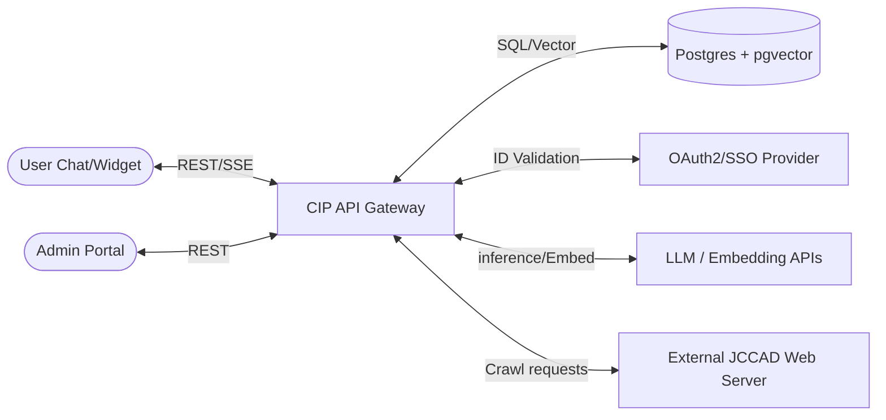
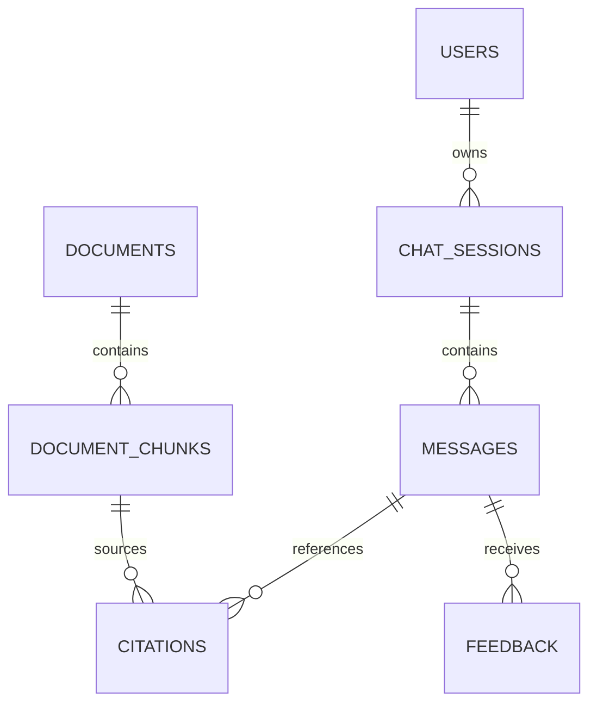

# Software Requirements Specification (SRS)
## JCCAD Company Intelligence Platform (CIP)

**IEEE Std 830-1998 Conformant Blueprint**

| Version | Date | Description | Author | Status |
| :--- | :--- | :--- | :--- | :--- |
| v1.0.0 | 2026-06-30 | Baseline Technical Specification | Enterprise Architecture Team | Approved |

---

## 1. Introduction

### 1.1 Purpose
This Software Requirements Specification (SRS) establishes the definitive technical blueprint and system specifications for the **JCCAD Company Intelligence Platform (CIP)**. It defines the functional, non-functional, security, data, and algorithmic requirements for the platform's execution, facilitating independent, parallel development by frontend, backend, database, and AI teams.

### 1.2 Scope
CIP is an enterprise-grade AI-powered knowledge management and conversational agent system. The system ingests JCCAD's corporate assets (PDF, DOCX, PPTX documents, crawled websites, and administrative company profile entries), stores them in a hybrid semantic-keyword relational structure, and exposes them through a secure, roles-aware conversational chat interface. The scope includes:
1. A web-based conversational client interface (supporting token streaming, source citation highlighting, multimodal input, and suggested follow-ups).
2. A decoupled admin portal managing the knowledge base, company metadata profile, and system analytics.
3. An ingestion engine executing document parsing, recursive chunking, and embedding.
4. An automated web crawler and hash-based delta synchronizer.
5. A contextual router routing queries between RAG-backed **Company Expert Mode** and generic **General AI Mode**.
6. Strict Role-Based Access Control (RBAC) governing data retrieval and system actions.

### 1.3 Definitions
* **Chunk:** A granular text segment extracted from a parent document, parsed to fit within model context limitations while retaining semantic meaning.
* **Grounding:** The practice of constraining the large language model's generation space exclusively to context segments supplied by the RAG pipeline.
* **Hybrid Search:** Search execution combining sparse lexical token matching (BM25) with dense vector distance evaluation (Cosine Similarity).
* **Semantic Routing:** The process of classifying intent by projecting input query vectors into a high-dimensional space and evaluating cosine similarity against predefined domain keywords.
* **Source Citation:** A traceable, authenticated link associating a generated phrase with a specific source document metadata node (document hash, name, and page number).

### 1.4 Abbreviations
* **API:** Application Programming Interface
* **ARIA:** Accessible Rich Internet Applications
* **BM25:** Best Matching 25 (Lexical Ranking Algorithm)
* **CIP:** Company Intelligence Platform
* **JWT:** JSON Web Token
* **LLM:** Large Language Model
* **PII:** Personally Identifiable Information
* **RAG:** Retrieval-Augmented Generation
* **RBAC:** Role-Based Access Control
* **RRF:** Reciprocal Rank Fusion
* **SSE:** Server-Sent Events
* **SSO:** Single Sign-On
* **VDB:** Vector Database
* **WCAG:** Web Content Accessibility Guidelines

### 1.5 References
1. *JCCAD Company Intelligence Platform (CIP) - Product Requirements Document (PRD)*, v1.0.0, June 2026.
2. *IEEE Std 830-1998*, IEEE Recommended Practice for Software Requirements Specifications.
3. *W3C Web Content Accessibility Guidelines (WCAG) 2.1*.

### 1.6 Overview
The remainder of this document outlines the JCCAD CIP system. Section 2 describes the high-level context, business context, operating environment, design constraints, and dependencies. Section 3 details the functional requirements for all 27 core components. Section 4 maps user workflows, Section 5 outlines system use cases, and Section 6 lists data requirements. Sections 7 through 15 define security, AI retrieval architectures, performance, reliability, accessibility, internationalization, error frameworks, logging, and analytics. Section 16 outlines acceptance criteria, and Section 17 provides the complete traceability matrix.

---

## 2. Product Overview

### 2.1 System Context
CIP operates as a centralized middleware service, interacting with users through a chat interface (or embeddable widget), administrators through a control dashboard, and external interfaces including authentication providers (OAuth/SAML) and third-party foundation models.



### 2.2 Business Context
JCCAD requires an automated customer and student support service that answers questions regarding CAD training, engineering services, internships, workshops, UAV research, and software solutions. The solution must reduce operational overhead by enabling non-technical admins to update the company parameters (Version 1) dynamically.

### 2.3 Target Users
The system serves Guest Users, authenticated Students, corporate Professionals, JCCAD Instructors/Employees, Managers, system Administrators, and Super Administrators. 

### 2.4 Product Perspective
CIP is designed as a standalone, modular service with a decoupled architecture. The frontend acts as a single-page application (SPA), communicating with the backend API layer. Storage is unified inside a relational database with vector capabilities (`pgvector`) to simplify backups, transactional consistency, and queries.

### 2.5 Operating Environment
* **Server Side:** Node.js (TypeScript) or Python (FastAPI), running in Docker containers, orchestrated via Kubernetes on Linux (Ubuntu 22.04 LTS).
* **Database:** PostgreSQL v15+ with `pgvector` extension.
* **Client Side:** React SPA, optimized for modern engines (Blink, WebKit, Gecko) on desktop and mobile viewports.

### 2.6 Design Constraints
* **No Database Over-coupling:** Vector and metadata relationships must be maintained using clean foreign key mappings.
* **Deterministic LLM Output:** Large Language Model temperature configuration must be set to `0.0` for all RAG/Expert Mode prompts to ensure query reproducibility.
* **Stateless API Gateway:** User sessions must be stored in Redis or database backends, keeping the API gateway stateless to allow autoscaling.

### 2.7 Assumptions
* Third-party foundation model providers guarantee API endpoint availability.
* User documents conform to structured file conventions (non-corrupted PDFs, PPTX, or DOCX formats).
* JCCAD DNS allows internal traffic to reach target web crawlers.

### 2.8 Dependencies
* **Auth Directory:** Integration with JCCAD LDAP or active directory for role resolution.
* **LLM Provider:** Stable HTTPS access to OpenAI API or Microsoft Azure OpenAI Service endpoints.
* **Storage Provider:** S3-compatible local or cloud object storage for retaining raw document binaries.

---

## 3. Functional Requirements

### 3.1 Chat Interface (FR-CHAT)
* **Purpose:** Provides the primary conversational user interface for interacting with the platform.
* **Inputs:** Keyboard/voice text characters, files (multimodal image uploads), selected configuration modes (Automatic/Expert/General).
* **Outputs:** SSE real-time streamed markdown response, sources display widget, suggested follow-ups, and copy/feedback buttons.
* **Workflow:**
  1. The user inputs a message in the chat input zone and presses "Send".
  2. The UI renders the user's message in the thread list, disables the input field, and sends a POST request to `/api/v1/chat/message`.
  3. The API gateway validates the token, extracts the payload, and establishes an SSE stream.
  4. The UI processes the stream, rendering characters incrementally.
  5. On stream completion, the UI enables the input field, displays citations, and renders suggested follow-up questions.
* **Business Rules:**
  * Guest chats are capped at 5 requests/minute.
  * Sessions are persisted in the SQL store for authenticated roles, but are transient in local storage for Guests.
* **Edge Cases:**
  * *Input during stream:* Disable text field input while a stream is in progress.
  * *Network disconnect during stream:* Render a reconnecting indicator. If connection is lost for >10s, output an error block with a retry button.
* **Validation Rules:** Maximum query character size is 2,000 characters. Clean HTML tags out of user inputs.
* **Error Conditions:**
  * Rate-limit exceeded (HTTP 429).
  * System offline (HTTP 503).
* **Recovery Behavior:** Display a standard user message: *"We are experiencing high traffic. Please wait [X] seconds and try again."*
* **Acceptance Criteria:** Under p95 load, the input text box must lock immediately upon send and render the streamed response within 1.0 second.
* **Performance Expectations:** UI transitions must occur at 60 FPS.
* **Priority:** Critical.
* **Dependencies:** None.

### 3.2 Company Expert Mode (FR-EXPERT)
* **Purpose:** Forces the LLM orchestrator to ground all answers in retrieved documents.
* **Inputs:** User query and retrieved document context chunks.
* **Outputs:** Answer text strictly derived from context, inline citations.
* **Workflow:**
  1. System context is constructed containing the RAG chunks and JCCAD dynamic profile metadata.
  2. The LLM processes the instructions and context under a strict system prompt.
  3. If context does not contain the answer, output the standardized fallback string.
* **Business Rules:** Strict temperature value of `0.0`. Absolutely no extrapolation.
* **Edge Cases:** Multiple documents conflicting (e.g., fee schedule 2025 vs. 2026). Propose the document with the latest modification timestamp.
* **Validation Rules:** Context chunks must not be empty.
* **Error Conditions:** Search index offline.
* **Recovery Behavior:** Fall back to warning prompt: *"Company databases are currently offline. Please try again shortly."*
* **Acceptance Criteria:** Spot checking 100 queries verifies that no response claims facts outside the provided RAG context.
* **Priority:** Critical.
* **Dependencies:** RAG Pipeline (FR-RAG).

### 3.3 General AI Mode (FR-GENERAL)
* **Purpose:** Enables standard LLM queries without company-specific restrictions.
* **Inputs:** User query, past session chat history messages.
* **Outputs:** Generative response text.
* **Workflow:**
  1. The API bypasses the RAG database retrieval.
  2. Synthesizes a system prompt defining the LLM as a helpful assistant.
  3. Returns streaming text directly from the model provider.
* **Business Rules:** Temperature set to `0.7` to permit standard creative/code tasks.
* **Edge Cases:** User asks JCCAD-specific queries in General Mode. Output a prompt suggesting: *"Would you like to search JCCAD Expert documents for an official answer?"*
* **Validation Rules:** standard length limits.
* **Error Conditions:** API quota exceeded.
* **Recovery Behavior:** Fallback to a secondary model provider endpoint.
* **Acceptance Criteria:** Correctly answers general coding and technical prompts without RAG data.
* **Priority:** High.
* **Dependencies:** None.

### 3.4 Automatic Mode Detection (FR-ROUTER)
* **Purpose:** Classifies user query intent to route between Expert and General modes automatically.
* **Inputs:** User text query.
* **Outputs:** Target mode classification (EXPERT/GENERAL).
* **Workflow:**
  1. Generate text embeddings for the user's query locally.
  2. Compute cosine similarity against JCCAD's core keyword vector definitions.
  3. If similarity exceeds `0.70`, return `EXPERT`; else, return `GENERAL`.
* **Business Rules:** The routing threshold is admin-configurable via the settings panel.
* **Edge Cases:** Ambiguous queries (e.g., "What is CAD?"). Classify as General AI, but present a suggested option: *"Search JCCAD Training Services instead"*.
* **Validation Rules:** Input query must contain semantic structure (non-special characters only).
* **Error Conditions:** Local embedding service failure.
* **Recovery Behavior:** Fallback to routing all queries to `EXPERT` mode to prioritize official brand safety.
* **Acceptance Criteria:** Correctly routes >95% of test prompts.
* **Priority:** High.
* **Dependencies:** None.

### 3.5 Conversation Memory (FR-MEMORY)
* **Purpose:** Maintains context within a chat session across multiple conversation turns.
* **Inputs:** Session token, historical message records.
* **Outputs:** Array of structured messages injected into the LLM context.
* **Workflow:**
  1. Read database chat records for the matching session token.
  2. Filter out systemic debug notes and validation logs.
  3. Inject the last 8 messages (4 user turns, 4 assistant turns) into the prompt context payload.
* **Business Rules:** Guest memory is transient and expires 30 minutes after last activity. Authenticated student/professional logs persist for 90 days.
* **Edge Cases:** Context window limit exceeded. Prune older history using a summarizing transformer.
* **Validation Rules:** Database message models must have strict timestamps.
* **Error Conditions:** Redis/SQL fetch timeout.
* **Recovery Behavior:** Fall back to a stateless query (zero historical context) and log the failure.
* **Acceptance Criteria:** Assistant correctly resolves pronouns (e.g., "Where is it located?" after asking about "CAD Training").
* **Priority:** Critical.
* **Dependencies:** PostgreSQL database.

### 3.6 Semantic Search (FR-SEMANTIC)
* **Purpose:** Retrieves semantically relevant context chunks from the vector database.
* **Inputs:** Embeddings of the user query.
* **Outputs:** Top 10 context chunks with matching similarity scores.
* **Workflow:**
  1. Convert text query to vector space using the embedding model API.
  2. Query `pgvector` table containing chunk embeddings using cosine distance:
     `SELECT chunk_text, metadata, 1 - (embedding <=> :query_vector) AS similarity FROM document_chunks ORDER BY similarity DESC LIMIT 10;`
  3. Return results filterable by user permission tags.
* **Business Rules:** Hard rejection of matching chunks with similarity score < 0.65.
* **Edge Cases:** Zero results found. Return empty set to trigger safe fallback response.
* **Validation Rules:** Embedding dimensionality must be exactly 1536.
* **Error Conditions:** Database connection pool exhausted.
* **Recovery Behavior:** Wait 500ms and execute retry cycle.
* **Acceptance Criteria:** Return semantically related files for queries with direct synonyms.
* **Priority:** Critical.
* **Dependencies:** Vector Database.

### 3.7 RAG Pipeline (FR-RAG)
* **Purpose:** Integrates retrieval, rank consolidation, and LLM prompting into a unified pipeline.
* **Inputs:** User query.
* **Outputs:** Context-grounded response text, citations list.
* **Workflow:**
  1. Retrieve lexical results via BM25 and semantic results via vector search.
  2. Apply Reciprocal Rank Fusion (RRF) to merge candidate lists.
  3. Execute Cohere Cross-Encoder Rerank API to select top 4 chunks.
  4. Format context blocks and compile system prompts.
  5. Call the LLM completion API and stream tokens.
* **Business Rules:** Only utilize chunks mapped to the user's role authorization list.
* **Edge Cases:** Model token limit overflow. Dynamically reduce chunk quantity to top 3.
* **Validation Rules:** Context chunks must contain exact source references.
* **Error Conditions:** Reranker API timeout.
* **Recovery Behavior:** Bypass reranking and feed the top 4 raw vector similarity search results directly to the LLM.
* **Acceptance Criteria:** End-to-end execution of RAG pipeline completes within p95 of 2.2 seconds.
* **Priority:** Critical.
* **Dependencies:** Semantic Search (FR-SEMANTIC), Vector Database.

### 3.8 Document Upload (FR-UPLOAD)
* **Purpose:** Allows administrators to upload raw knowledge files to the system.
* **Inputs:** PDF, DOCX, or PPTX files (Max size: 50MB per file).
* **Outputs:** Secure file storage URL, validation confirmation.
* **Workflow:**
  1. Administrator drags and drops a document into the Admin portal.
  2. The portal checks file extensions and sizes in browser.
  3. Uploads via multipart-form POST to `/api/v1/admin/knowledge/upload` with JWT headers.
  4. Server performs server-side file scan and writes to S3 object storage.
* **Business Rules:** Files must be stored using random UUID names in secure buckets.
* **Edge Cases:** Uploading identical documents. Flag as duplicate, show prompt to overwrite or cancel.
* **Validation Rules:** Block execution if MIME type does not match approved types (e.g., `application/pdf`).
* **Error Conditions:** Antivirus scan flag.
* **Recovery Behavior:** Immediately delete file from temporary buffers and alert the administrator.
* **Acceptance Criteria:** Multiple simultaneous 20MB file uploads complete without server latency spikes.
* **Priority:** High.
* **Dependencies:** Admin Dashboard (FR-ADMIN).

### 3.9 Document Processing (FR-PARSING)
* **Purpose:** Extracts text, tables, and metadata from uploaded document binaries.
* **Inputs:** Raw document from storage.
* **Outputs:** JSON array of parsed paragraphs, tables, and metadata schemas.
* **Workflow:**
  1. Ingestion service downloads file and processes text extraction (e.g., using `PyPDF2` or `unstructured`).
  2. Extract metadata (filename, page offsets, headers).
  3. Execute recursive token chunking.
  4. Send payloads to the embedding database.
* **Business Rules:** Retain structural layout in Markdown. Tables must be preserved as Markdown table strings.
* **Edge Cases:** Scanned document containing images only. Route through OCR parser.
* **Validation Rules:** Ensure parsed output text length is within 10% of raw text extraction estimations.
* **Error Conditions:** Parsing memory limit exceeded.
* **Recovery Behavior:** Terminate parsing process, set database document state to `FAILED`, release buffers, and notify the admin dashboard.
* **Acceptance Criteria:** Standard 10-page text PDF successfully parses and chunks in under 5 seconds.
* **Priority:** High.
* **Dependencies:** Document Upload (FR-UPLOAD).

### 3.10 Website Crawling (FR-CRAWL)
* **Purpose:** Crawls external JCCAD public pages to ingest information.
* **Inputs:** Seed URL, depth limit, exclusions regex list.
* **Outputs:** Parsed text and HTML structures.
* **Workflow:**
  1. The admin triggers a crawl action via the dashboard.
  2. Crawl controller initiates queue with seed URL.
  3. Crawler fetches HTML, checks boundaries, strips CSS exclusions, and saves cleaned Markdown context.
* **Business Rules:** Respect `robots.txt` and maintain a 1-second politeness delay.
* **Edge Cases:** Crawler hits a redirect loop. Cap max redirects at 3.
* **Validation Rules:** Target domains must match the primary JCCAD domain whitelist.
* **Error Conditions:** Server timeout (408).
* **Recovery Behavior:** Retry crawl of specific page twice before flagging it as failed in crawl records.
* **Acceptance Criteria:** Successfully crawls 50 nested JCCAD site pages without losing host server availability.
* **Priority:** Medium.
* **Dependencies:** S3 Storage.

### 3.11 Website Synchronization (FR-SYNC)
* **Purpose:** Regularly checks and updates crawled web content.
* **Inputs:** Crawl schedules, target site list.
* **Outputs:** Updated indices, deleted stale vector chunks.
* **Workflow:**
  1. Trigger task on CRON pattern.
  2. Fetch page, calculate content SHA256 hash.
  3. Compare with database record.
  4. If hash is modified, wipe past chunks of the matching URL and insert newly generated embeddings.
* **Business Rules:** Synced items inherit access control parameters of the crawler configuration.
* **Edge Cases:** Crawled URL no longer exists (404). Purge vector records for that page.
* **Validation Rules:** Valid schedule expressions.
* **Error Conditions:** Host completely down.
* **Recovery Behavior:** Send notification email to the admin and pause the schedule.
* **Acceptance Criteria:** Automatically identifies and replaces modified content within 5 minutes of crawl trigger.
* **Priority:** Medium.
* **Dependencies:** Website Crawling (FR-CRAWL).

### 3.12 Knowledge Base (FR-KNOWLEDGE)
* **Purpose:** Provides a centralized control panel for all company knowledge assets.
* **Inputs:** CRUD queries from administrators.
* **Outputs:** SQL tables, search views.
* **Workflow:**
  1. Admins query database structures via the dashboard to view knowledge items.
  2. Admin modifies an entity or edits metadata tag parameters.
  3. Server updates record and syncs with vector stores.
* **Business Rules:** Non-admins cannot read raw documents directly without permission tags.
* **Edge Cases:** Deleting a document that is actively being queried. Implement soft-delete flags.
* **Validation Rules:** Metadata names must use alphanumeric characters.
* **Error Conditions:** Database locking errors.
* **Recovery Behavior:** Terminate transaction, revert state, and try again.
* **Acceptance Criteria:** Admin can view, query, filter, and delete document entries instantly.
* **Priority:** High.
* **Dependencies:** PostgreSQL.

### 3.13 Company Profile Management (FR-PROFILE)
* **Purpose:** Manages the baseline JCCAD Company Profile metadata dynamically.
* **Inputs:** Form input strings (Primary Services, Domains, Organization Type).
* **Outputs:** Updated database JSON records.
* **Workflow:**
  1. Admin opens Profile tab, updates fields (e.g., changes domain name), and clicks "Save".
  2. Server updates relational record.
  3. Server triggers system prompt compiler, updating cached base instructions.
* **Business Rules:** Validates structure format against target JSON models.
* **Edge Cases:** Blank values sent. Prevent submit of empty fields.
* **Validation Rules:** Text fields must pass basic injection validation.
* **Error Conditions:** Database write block.
* **Recovery Behavior:** Restore cached system prompts from local server memory state.
* **Acceptance Criteria:** Updating fields immediately alters the system behavior in subsequent chat messages.
* **Priority:** High.
* **Dependencies:** PostgreSQL.

### 3.14 Analytics (FR-ANALYTICS)
* **Purpose:** Tracks usage statistics and outputs them visually.
* **Inputs:** Message payloads, latency metrics, user feedback marks.
* **Outputs:** Timeseries charts, data export files.
* **Workflow:**
  1. The API log service intercepts queries, writes anonymized records to storage.
  2. Analytics engine calculates averages (token counts, feedback percentages).
  3. Admin opens Analytics tab and renders diagrams.
* **Business Rules:** Mask PII and usernames in aggregated dashboards.
* **Edge Cases:** Large data sets. Cache analytics daily to prevent load latency.
* **Validation Rules:** Date range selection constraints.
* **Error Conditions:** Query timeouts.
* **Recovery Behavior:** Serve cached dataset.
* **Acceptance Criteria:** Displays dashboards in under 1.5 seconds.
* **Priority:** Medium.
* **Dependencies:** None.

### 3.15 Feedback (FR-FEEDBACK)
* **Purpose:** Records user responses to evaluate quality.
* **Inputs:** Thumbs-up/down choices, category tag selections, comments.
* **Outputs:** Recorded feedback entries.
* **Workflow:**
  1. User clicks thumbs-down icon.
  2. Form overlay requests failure reasons.
  3. Send data packet to database backend.
* **Business Rules:** Connects feedback object to exact session token and prompt ID.
* **Edge Cases:** User submits spam clicks. Rate limit feedback endpoints.
* **Validation Rules:** Maximum comment character count is 500 characters.
* **Error Conditions:** Connection failures.
* **Recovery Behavior:** Store logs in user browser local storage and retry on next page reload.
* **Acceptance Criteria:** Correctly registers user metrics in the database.
* **Priority:** Medium.
* **Dependencies:** None.

### 3.16 Suggested Questions (FR-SUGGESTIONS)
* **Purpose:** Generates dynamic, context-relevant follow-up prompts.
* **Inputs:** User query and assistant response.
* **Outputs:** Array of three text strings.
* **Workflow:**
  1. Pass message payload to a fast generator model.
  2. Model returns three follow-up prompts.
  3. UI displays prompts as clickable chips below response message.
* **Business Rules:** Suggestions must not contain general system prompts.
* **Edge Cases:** Generation fails. Fall back to standard statically-defined company FAQs (e.g., "Tell me about CAD courses").
* **Validation Rules:** Formatted as single short question sentences.
* **Error Conditions:** Model failure.
* **Recovery Behavior:** Fall back to company FAQs.
* **Acceptance Criteria:** Displays chips matching chat context.
* **Priority:** Low.
* **Dependencies:** LLM API.

### 3.17 Image Understanding (FR-VISION)
* **Purpose:** Analyzes images (CAD drawings, documents) using multimodal models.
* **Inputs:** User text query and raw image.
* **Outputs:** Contextual text response.
* **Workflow:**
  1. User uploads a PNG drawing, adds a text query.
  2. API gateway validates size and type.
  3. Vision model processes image arrays and outputs descriptions.
  4. Core RAG pipeline uses descriptors to pull matching context.
* **Business Rules:** Restrict user upload sizes to 10MB.
* **Edge Cases:** Image lacks clear structures. Output: *"I cannot parse this image clearly. Please upload a higher resolution document."*
* **Validation Rules:** Whitelisted mime types (`image/png`, `image/jpeg`).
* **Error Conditions:** Vision endpoint timeout.
* **Recovery Behavior:** Output standard error message.
* **Acceptance Criteria:** Accurately extracts text and structural elements from CAD blueprints.
* **Priority:** Medium.
* **Dependencies:** Multimodal Model Endpoint.

### 3.18 Source Citations (FR-CITATIONS)
* **Purpose:** Displays source references for generated answers.
* **Inputs:** Reranked document chunk metadata.
* **Outputs:** Citation tags mapping directly to document pages.
* **Workflow:**
  1. RAG pipeline selects top chunks.
  2. Appends index metadata to generated sentences.
  3. UI renders indices as clickable superscript tooltips.
* **Business Rules:** Hide source filenames that users do not have permissions to read.
* **Edge Cases:** Document has no page references (e.g., website page). Link to source URL.
* **Validation Rules:** Citations must point to valid database documents.
* **Error Conditions:** Broken document links.
* **Recovery Behavior:** Render text citation block without a hyperlink.
* **Acceptance Criteria:** Users can click superscript links to view document source pages.
* **Priority:** Critical.
* **Dependencies:** RAG Pipeline.

### 3.19 Streaming Responses (FR-STREAM)
* **Purpose:** Streams response tokens back to the user in real time.
* **Inputs:** LLM generation event loop.
* **Outputs:** Chunked SSE payloads.
* **Workflow:**
  1. Establish HTTP connection with stream headers.
  2. Stream tokens to API gateway.
  3. Forward tokens directly to the client.
* **Business Rules:** Send chunks using JSON formatted data arrays.
* **Edge Cases:** Connection closes unexpectedly. Cache generated text in Redis session store.
* **Validation Rules:** Correct headers (`Content-Type: text/event-stream`).
* **Error Conditions:** Stream interrupts mid-sentence.
* **Recovery Behavior:** Close connection and display retry button.
* **Acceptance Criteria:** Render text incrementally without interface lag.
* **Priority:** High.
* **Dependencies:** HTTP Server.

### 3.20 Authentication (FR-AUTH)
* **Purpose:** Verifies user identities before system access.
* **Inputs:** Credentials, OAuth/SAML payloads.
* **Outputs:** JWT payload containing user roles.
* **Workflow:**
  1. User navigates to Login page.
  2. UI redirects to SSO platform.
  3. After login, identity provider redirects user with access token.
  4. Server generates JWT session cookie.
* **Business Rules:** Access tokens expire in 1 hour. Refresh tokens expire in 24 hours.
* **Edge Cases:** SSO provider offline. Display message to use offline login methods.
* **Validation Rules:** Use cryptographically signed tokens.
* **Error Conditions:** Invalid credentials (HTTP 401).
* **Recovery Behavior:** Lock accounts for 15 minutes after 5 failed attempts.
* **Acceptance Criteria:** Securely logs in and issues JWT tokens.
* **Priority:** Critical.
* **Dependencies:** None.

### 3.21 Authorization (FR-AUTHZ)
* **Purpose:** Enforces permissions based on authenticated user roles.
* **Inputs:** Request path, JWT payload.
* **Outputs:** Boolean access permit.
* **Workflow:**
  1. Middleware checks route policies against the user's role.
  2. If allowed, execute API request; else, block and return access denied.
* **Business Rules:** Implement strict deny-by-default access policies.
* **Edge Cases:** Role mappings missing from token. Deny access.
* **Validation Rules:** Match route paths against RBAC configurations.
* **Error Conditions:** Unauthorized (HTTP 403).
* **Recovery Behavior:** Redirect users to Login dashboard page.
* **Acceptance Criteria:** Guest users cannot access the admin panel.
* **Priority:** Critical.
* **Dependencies:** Authentication (FR-AUTH).

### 3.22 Role Management (FR-ROLES)
* **Purpose:** Manages system roles and permissions mappings.
* **Inputs:** CRUD queries from Super Administrators.
* **Outputs:** Updated SQL role-mapping matrix.
* **Workflow:**
  1. Super Admin opens Role Configuration tab.
  2. Selects a role, modifies access tags, and saves.
  3. Server updates global permission policies.
* **Business Rules:** The role permissions must be updated in database policies immediately.
* **Edge Cases:** Removing permissions from active user sessions. Force JWT refresh.
* **Validation Rules:** System must have at least one Super Administrator.
* **Error Conditions:** Missing data parameters.
* **Recovery Behavior:** Roll back update transactions.
* **Acceptance Criteria:** Restricts system permissions instantly.
* **Priority:** High.
* **Dependencies:** PostgreSQL database.

### 3.23 Admin Dashboard (FR-ADMIN)
* **Purpose:** Provides a centralized management portal for Administrators.
* **Inputs:** Browser click events.
* **Outputs:** Visual management interfaces.
* **Workflow:**
  1. Administrator logs in, routes to dashboard.
  2. UI loads layout containing files, settings, and analytics.
* **Business Rules:** Restrict access strictly to authenticated Admin and Super Admin roles.
* **Edge Cases:** Non-admin attempts route injection. Force dashboard redirect.
* **Validation Rules:** HTML markup must be clean.
* **Error Conditions:** Failed API handshakes.
* **Recovery Behavior:** Display connection error modal.
* **Acceptance Criteria:** Renders full configuration suite to authorized admins.
* **Priority:** Critical.
* **Dependencies:** Authorization (FR-AUTHZ).

### 3.24 Settings (FR-SETTINGS)
* **Purpose:** Configures global system parameters.
* **Inputs:** Form settings (Rate limits, token sizes, model temperatures).
* **Outputs:** Configuration parameter state.
* **Workflow:**
  1. Admin opens Settings panel.
  2. Updates parameters and clicks Save.
  3. Server updates settings cache.
* **Business Rules:** Validate values against system safe ranges.
* **Edge Cases:** Sending extreme configurations.
* **Validation Rules:** Check rates are within boundaries.
* **Error Conditions:** DB save failure.
* **Recovery Behavior:** Revert cache to active values.
* **Acceptance Criteria:** Instantly configures system constraints.
* **Priority:** High.
* **Dependencies:** PostgreSQL.

### 3.25 Monitoring (FR-MONITORING)
* **Purpose:** Evaluates system metrics (memory, CPU, API latency).
* **Inputs:** System logs, usage metrics.
* **Outputs:** Prometheus metrics endpoint `/metrics`, health checks.
* **Workflow:**
  1. Gateway monitors performance parameters.
  2. Outputs Prometheus metrics.
  3. Alerts send via Webhook on threshold exceptions.
* **Business Rules:** Run health checks every 10 seconds.
* **Edge Cases:** Monitoring engine goes offline. Alert fallback systems.
* **Validation Rules:** Correct formats.
* **Error Conditions:** Alert failure.
* **Recovery Behavior:** Retain internal metrics queue in server memory.
* **Acceptance Criteria:** Exposes telemetry data correctly.
* **Priority:** Medium.
* **Dependencies:** Prometheus.

### 3.26 Logging (FR-LOGGING)
* **Purpose:** Captures audit records and system events.
* **Inputs:** Log statements from all components.
* **Outputs:** Log streams sent to standard output (stdout/stderr).
* **Workflow:**
  1. Application writes JSON logs containing error, warning, or info levels.
  2. Log collectors (e.g., Fluentd) ingest the streams and forward to central storage.
* **Business Rules:** Anonymize passwords, JWTs, and PII elements before writing logs.
* **Edge Cases:** Logging storage limit reached. Implement circular log buffers.
* **Validation Rules:** Conform strictly to JSON logging formats.
* **Error Conditions:** Local filesystem write error.
* **Recovery Behavior:** Attempt memory buffering of critical errors.
* **Acceptance Criteria:** Generates searchable audit trails.
* **Priority:** High.
* **Dependencies:** None.

### 3.27 Notifications (FR-NOTIFY)
* **Purpose:** Alerts administrators regarding system status or parsing errors.
* **Inputs:** Event triggers.
* **Outputs:** Email messages, Admin Dashboard status icons.
* **Workflow:**
  1. System encounters failure (e.g., crawler timeout).
  2. Dispatches alert payload to notification dispatcher.
  3. Dispatches SMTP email messages to administrators.
* **Business Rules:** Aggregate notification emails to prevent spamming admins.
* **Edge Cases:** SMTP gateway down. Queue alerts in database table.
* **Validation Rules:** Valid admin emails.
* **Error Conditions:** SMTP connection failures.
* **Recovery Behavior:** Log warning message.
* **Acceptance Criteria:** Delivers error notifications within 2 minutes.
* **Priority:** Low.
* **Dependencies:** SMTP Server.

---

## 4. User Workflows

### 4.1 Guest Workflow
* **Normal Flow:**
  1. Navigates to JCCAD public home page.
  2. Clicks Chat widget.
  3. Sends query: "What CAD courses are offered?".
  4. Automatic Mode Router identifies context similarity, activates Company Expert Mode, retrieves syllabus, and outputs streaming response with source citations.
* **Alternative Flow:**
  1. Sends query: "Write a JavaScript function".
  2. Router identifies low similarity score, switches to General AI Mode, and streams response.
* **Exception Flow:**
  1. Sends message exceeding rate limit.
  2. Chat widget displays: *"Rate limit exceeded. Please wait 1 minute before your next question."*

### 4.2 Student Workflow
* **Normal Flow:**
  1. Logs in via Student Portal, authenticated by OAuth SSO.
  2. Chat UI restores past session history.
  3. Uploads CAD image: "What is wrong with this drawing?".
  4. Vision model parses drawing and returns analytical feedback.
* **Alternative Flow:**
  1. Switches mode selector manually to General AI Mode.
  2. Asks general engineering questions.
* **Exception Flow:**
  1. Uploads corrupted image file.
  2. Chat UI warns: *"Image format invalid. Please upload a valid PNG or JPEG."*

### 4.3 Professional Workflow
* **Normal Flow:**
  1. Logs in via Client Portal.
  2. Asks: "What UAV services do you offer?".
  3. Expert Mode retrieves research files, outputs services, and renders email link.
* **Alternative Flow:**
  1. Reviews source documentation citations by clicking popover links.
* **Exception Flow:**
  1. Requests document reserved for Employees.
  2. Vector search filters out the restricted document. Response states: *"I cannot find that information in JCCAD's official public documentation."*

### 4.4 Employee Workflow
* **Normal Flow:**
  1. Logs in via SSO.
  2. Queries: "What is the policy for internal lab usage?".
  3. Search validates `Employee` authorization tags, retrieves restricted document context, and streams the answer.
* **Alternative Flow:**
  1. Submits positive feedback with comments to note a training document typo.
* **Exception Flow:**
  1. Relational database offline.
  2. Chat renders error: *"System databases are currently offline. Retrying connection..."*

### 4.5 Manager Workflow
* **Normal Flow:**
  1. Logs in.
  2. Opens Analytics dashboard, reviews token cost charts, audits thumbs-down responses, and exports report.
* **Alternative Flow:**
  1. Filters feedback logs to isolate "Inaccurate information" categories.
* **Exception Flow:**
  1. Requests a data report matching date ranges with zero logs.
  2. Page displays message: *"No log details found for selected time bounds."*

### 4.6 Administrator Workflow
* **Normal Flow:**
  1. Logs in, accesses Admin Portal.
  2. Uploads updated course syllabus PDF.
  3. System parses document, creates embeddings, updates vector database index, and notifies completion.
* **Alternative Flow:**
  1. Configures crawler parameters and schedules weekly web sync.
* **Exception Flow:**
  1. Uploads PDF with encrypted contents.
  2. Dashboard processing transitions status to `FAILED` with details: *"Document is password-protected or encrypted."*

### 4.7 Super Administrator Workflow
* **Normal Flow:**
  1. Authenticates, opens Settings panel.
  2. Modifies system parameters (rate limits, model endpoint, credentials, RBAC configuration).
  3. Saves configurations, and updates system variables dynamically.
* **Alternative Flow:**
  1. Views secure security audit logs.
* **Exception Flow:**
  1. Attempts to delete all Super Administrator accounts.
  2. UI blocks operation: *"At least one Super Administrator account must exist."*

---

## 5. Use Cases

### 5.1 Use Case UC-1: Upload and Process Company Knowledge Base Documents
* **Actors:** Administrator
* **Preconditions:** Administrator is logged in and authorized.
* **Postconditions:** Document chunks are parsed, vectorized, and indexable.
* **Normal Flow:**
  1. Admin opens Knowledge Base panel.
  2. Clicks Upload, selects `Syllabus_CAD_Training_2026.pdf`.
  3. Ingestion engine parses PDF formatting.
  4. Generates sliding-window chunk arrays.
  5. Computes vector embeddings and saves records.
  6. Document status is updated to `INDEXED` in the dashboard list.
* **Alternative Flow:**
  1. Admin uploads DOCX file. Ingestion converter maps structures to Markdown format before processing.
* **Exception Flow:**
  1. Uploaded file exceeds 50MB. UI blocks upload.
* **Business Rules:** Parsed contents inherit default access tags based on document directories.
* **Priority:** High.

### 5.2 Use Case UC-2: Dynamic Query Routing and RAG Execution
* **Actors:** Student, Professional, Guest, Employee
* **Preconditions:** System API online.
* **Postconditions:** User receives a streaming, cited response.
* **Normal Flow:**
  1. User enters: "Tell me about JCCAD UAV Research capabilities."
  2. Intent router identifies JCCAD context, selects Company Expert Mode.
  3. Embedding generator embeds prompt.
  4. Database executes hybrid lexical-vector query against authorized chunks.
  5. Reranker selects top 4 contexts.
  6. Assistant compiles prompt, streams text tokens, and appends citations.
* **Alternative Flow:**
  1. User asks general question. Router identifies low similarity, executes General AI Mode, and returns response.
* **Exception Flow:**
  1. Semantic search fails to locate relevant chunks. System returns fallback text: *"I cannot find that information in JCCAD's official documentation."*
* **Business Rules:** LLM generation must use temperature `0.0` in Expert Mode.
* **Priority:** Critical.

---

## 6. Data Requirements

### 6.1 Entity Relationship Model
The diagram defines the database relationships (PostgreSQL + pgvector):



### 6.2 Data Entities & Metadata Dictionary

| Entity | Purpose | Owner | Validation | Lifecycle | Retention |
| :--- | :--- | :--- | :--- | :--- | :--- |
| **Users** | Core account profiles. | Super Admin | Unique email format, secure hashed password. | Active until account deletion. | Indefinite. |
| **Chat Sessions** | Tracks conversation groups. | User | UUID string token format. | Created on first query, soft-deletes. | Guests: 30 mins; Authenticated: 90 days. |
| **Messages** | Indivisible chat dialogue elements. | User | Valid message type schema (User, Assistant, System). | Created on message receipt, read-only. | Matches parent Chat Session lifetime. |
| **Citations** | Connects messages to source files. | System | Source document ID exists. | Auto-generated on output, read-only. | Indefinite. |
| **Feedback** | Log user response ratings. | Manager | Values must map to positive/negative flags. | Created on user submit, permanent. | 1 year. |
| **Documents** | Master records of files. | Admin | Valid file size and hash. | Indexed to Deleted lifecycle states. | Persistent until admin purges file. |
| **Document Chunks**| Text blocks and vector arrays. | Admin | Vector size is exactly 1536 dimensions. | Auto-generated on parser runs. | Purged on parent document delete. |

---

## 7. Security Requirements

### 7.1 Authentication
* Integrates OAuth 2.0 and SAML 2.0 with JCCAD SSO directories.
* Standard tokens must use signed HS256/RS256 JWT schemas.

### 7.2 Authorization
* Enforce Role-Based Access Control (RBAC) at the middleware layer.
* Access maps to Guest, Student, Professional, Employee, Manager, Admin, and Super Admin roles.

### 7.3 Encryption
* **In Transit:** Enforce HTTPS using TLS 1.3. Reject TLS 1.1 or lower.
* **At Rest:** Database volumes and object storage buckets must be encrypted using AES-256 (AWS KMS or local encrypted loopback structures).

### 7.4 Password Storage
* Cryptographic hashes of all native passwords must use the Argon2id or bcrypt hashing function with a cost parameter of at least 12 rounds.

### 7.5 Session Management
* Session tokens must be stored in secure HTTP-only, SameSite=Strict cookies.
* Automatically expire inactive sessions after 15 minutes of inactivity.

### 7.6 Audit Logs
* Write write-only logs for administrative changes (deleting files, configuring parameters, role adjustments).
* Include actor ID, client IP, action name, resource, and timestamp parameters.

### 7.7 Rate Limiting
* Limit rate via IP and user IDs:
  * Guest: 5 requests / minute.
  * Authenticated: 60 requests / minute.

### 7.8 Prompt Injection Protection
* Implement system instruction isolation using structural XML formatting templates (e.g., `<user_input> {{query}} </user_input>`).
* Run input queries through classification guards (e.g., Llama Guard) to block dynamic command overrides.

### 7.9 Cross Site Scripting (XSS) Protection
* Escape all output text in client rendering modules.
* Enforce Content Security Policies (CSP) to restrict scripts only to validated whitelisted domains.

### 7.10 Cross Site Request Forgery (CSRF) Protection
* Implement anti-CSRF token handshakes for all non-GET API requests.

### 7.11 Secure File Upload & Validation
* Validate file contents using magic-byte headers, blocking executable file types.
* Process files within isolated sandbox containers. Run antivirus evaluations using ClamAV before parsing payloads.

### 7.12 Privacy & Compliance
* Adhere to GDPR constraints. Include user interface controls to allow users to completely purge their chat histories.

---

## 8. AI Requirements

### 8.1 Prioritized Knowledge Grounding
System answers must be derived from ingested sources in Company Expert Mode. The model is prohibited from referencing its base weights if direct contradictions occur.

### 8.2 Semantic Retrieval Architecture
* Perform vector queries against PostgreSQL databases.
* **lexical Search:** Match terms using `tsvector` with BM25-based parameters.
* **Rank Conjunction:** Merge vector similarity lists with BM25 outputs using Reciprocal Rank Fusion (RRF). Rerank results with Cohere Cross-Encoder APIs, preserving the top 4 contexts.

### 8.3 Context Assembly & Prompt Formatting
Compile prompts using a structured template to format context blocks clearly:

```
[System Instruction]
You are the official JCCAD intelligence system...
Answer using ONLY the contexts listed below.

[Context 1]
Source: Syllabus_CAD_Training.pdf (Page 3)
Content: "CAD training courses occur on Mondays..."

[Context 2]
Source: www.jccad.com/services
Content: "JCCAD provides UAV drone testing..."

[User Question]
What CAD training courses occur?
```

### 8.4 Memory Retention
Maintain session memory by feeding the last 8 conversation messages back to the LLM to preserve context.

### 8.5 Citation Generation
Ensure accuracy by mapping citation links directly to source document structures:
* Format outputs using inline markers: `[Source Name, Page X]`.
* Render markers as clickable links pointing to target document nodes.

### 8.6 Minimizing Hallucinations
Configure model temperature parameters to exactly `0.0`. Set `presence_penalty` and `frequency_penalty` to `0` to prevent divergent responses.

### 8.7 Fallback Actions
If search similarity is low or search returns no results, output: *"I cannot verify this detail from our databases. Please contact us directly at info@jccad.com."*

### 8.8 Confidence Scoring
If the top match has a similarity score $< 0.70$, output the standard fallback response.

### 8.9 Unsupported Questions
If a query asks for information not in JCCAD documentation, output: *"I cannot find that information in JCCAD's official files. Would you like me to answer using general knowledge?"* If the user selects Yes, route the query to General AI Mode.

---

## 9. Performance Requirements

### 9.1 Latency
* **p95 Time to First Token:** $< 800$ms under a load of 50 concurrent requests.
* **p95 Search Pipeline Latency:** $< 250$ms.

### 9.2 Concurrent Users
* Scale backend components horizontally to support up to 1,000 active concurrent chat sessions.

### 9.3 Streaming Mechanics
* Use Server-Sent Events (SSE) to stream output tokens. Streamed chunks must be sent using UTF-8 text payloads.

### 9.4 Caching Strategies
* Cache vector embedding lookups in Redis for 24 hours to reduce external API costs for duplicate queries.
* Cache the parsed company profile configuration in local server memory.

### 9.5 Scalability Goals
* Scale server containers automatically using Kubernetes HPA metrics (CPU usage $> 75\%$ or RAM usage $> 80\%$).

### 9.6 Availability Targets
* Target a service availability of $99.9\%$ annually.

### 9.7 Telemetry Monitoring
* Expose performance metrics at `/metrics` to allow collection by Prometheus scraping services.

---

## 10. Reliability

### 10.1 Backup Strategy
* Perform daily automated snapshots of database instances.
* Replicate backups across regions. Retain snapshots for 30 days.

### 10.2 Disaster Recovery (DR)
* Maintain a multi-region Active-Passive failover configuration.
* Target a Recovery Time Objective (RTO) of $< 10$ minutes, and a Recovery Point Objective (RPO) of $< 1$ minute.

### 10.3 Retry Mechanisms
* Apply exponential backoff when calling external APIs (e.g., OpenAI / Cohere):
  * Initial delay: 500ms.
  * Max retries: 3.
  * Backoff factor: 2.0.

### 10.4 Graceful Degradation
* If the vector database goes offline, fall back to basic database lookup queries.
* If all search services fail, fall back to General AI Mode and notify the user that company-specific sources are temporarily offline.

### 10.5 Failure Handling
* Log API failures with complete context details, but omit client credentials or user PII.

---

## 11. Accessibility

### 11.1 Keyboard Navigation
* Ensure all elements can be focused and operated using standard keyboard controls (Tab, Enter, Escape).

### 11.2 Color Contrast
* Ensure all text elements meet WCAG 2.1 AA requirements by maintaining a contrast ratio of at least 4.5:1.

### 11.3 ARIA
* Decorate all interactive components with ARIA tags:
  * Chat status indicators: `aria-live="polite"`.
  * Buttons: `aria-label="Upload File"`.

### 11.4 Screen Readers
* Ensure the DOM layout follows a logical structure to allow screen readers to parse information in the correct order.

### 11.5 Responsive Design
* Design layouts to adjust dynamically to client resolutions:
  * Mobile viewports: $< 768$px.
  * Tablet viewports: $768$px to $1024$px.
  * Desktop viewports: $> 1024$px.

---

## 12. Internationalization (I18n)

### 12.1 Language Switching
* Support English, Spanish, German, Japanese, and French. Include a language selection dropdown in the Settings panel.

### 12.2 Unicode Support
* Store all database entries, files, and text strings using UTF-8 encoding.

### 12.3 Right-to-Left (RTL) Considerations
* Design the UI layout to adjust dynamically (`dir="rtl"`) when RTL languages (e.g., Arabic) are selected.

### 12.4 Date Formats
* Format dates dynamically using locale settings (e.g., English: `MM/DD/YYYY`, European: `DD/MM/YYYY`).

### 12.5 Number Formats
* Format numeric values according to regional standards (e.g., English: `1,000.00`, German: `1.000,00`).

---

## 13. Error Handling

### 13.1 Error Framework

| Category | Cause | User-Facing Message | HTTP Code | Severity | Recovery Action |
| :--- | :--- | :--- | :--- | :--- | :--- |
| **API Failure** | LLM endpoint timeout. | *"We are experiencing connection issues. Please try again."* | 504 | High | Route query to secondary fallback model. |
| **Auth Failure**| Expired JWT token. | *"Your session has expired. Please log in again."* | 401 | Medium | Redirect user back to JCCAD Login page. |
| **Validation** | Uploaded file size $> 50$MB. | *"File size exceeds the 50MB limit."* | 400 | Low | Re-enable upload inputs, reset file selection. |
| **Database** | DB connection timeout. | *"System is temporarily unavailable. Retrying..."* | 500 | Critical | Attempt connection pool reset, alert admin. |
| **Rate Limit** | Requests $> 5$ / min. | *"Too many requests. Please wait before typing."* | 429 | Low | Temporarily disable the user input text field. |

---

## 14. Logging

### 14.1 Logger Policies
* Implement JSON formatting for all application logs.
* Write logs directly to standard streams (`stdout`/`stderr`).

### 14.2 Log Retention
* Retain logs locally for 7 days. Stream logs to central storage for long-term retention of 90 days.

### 14.3 Sensitive Information Filtering
* Run log strings through filtering regexes to redact sensitive data:
  ```regex
  (password|jwt|authorization|token|secret)\s*:\s*".*?"
  ```

### 14.4 Auditable Security Events
* Log authorization failures, role configuration changes, metadata updates, and logins.

---

## 15. Analytics

### 15.1 Collected Telemetry Metrics
* **Token Usage:** Daily token consumption.
* **Latency:** End-to-end response time.
* **User Feedback:** Thumbs-up/down feedback ratios.
* **Active Sessions:** Daily concurrent active users.

### 15.2 Metric Calculations
* **Feedback Ratio Calculation:**
  $$\text{Ratio} = \frac{\text{Thumbs-Up Events}}{\text{Thumbs-Up Events} + \text{Thumbs-Down Events}}$$
* **p95 Latency Calculation:** Sort response latencies and return the value at the 95th percentile.

### 15.3 Dashboard Visualizations
* Render time-series charts displaying message latency and user feedback ratios.
* Export analytics logs as CSV or JSON files.

### 15.4 Data Privacy Constraints
* Hash IP addresses and mask names in analytics databases.

---

## 16. Acceptance Criteria

* **AC-1 (Dynamic Company Profile):** Changing the service name in the Admin panel must dynamically update the chatbot's response in subsequent queries.
* **AC-2 (Search Latency):** Vector query and reranking pipelines must complete within 250ms under simulated loads of 50 concurrent requests.
* **AC-3 (Grounding Accuracy):** Verification test suites must verify that Company Expert Mode does not make claims outside of the provided RAG context.
* **AC-4 (XSS Protection):** Verifies that chat inputs containing Javascript payload scripts do not execute in the client browser.
* **AC-5 (Accessibility):** The chat interface must score 100% on WCAG 2.1 AA compliance audits.

---

## 17. Traceability Matrix

| Business Goal | Product Feature | Technical Requirement | Acceptance Criteria |
| :--- | :--- | :--- | :--- |
| **Reduce support overhead** | Chat Interface | FR-CHAT | AC-1: Dynamic Profile Update |
| **Prevent hallucinations** | Company Expert Mode | FR-EXPERT | AC-3: Context Grounding |
| **Deliver fast responses** | Streaming Responses | FR-STREAM | AC-2: Latency < 250ms |
| **Protect IP and data** | Authorization | FR-AUTHZ | AC-4: XSS / RBAC validation |
| **Improve student reach** | Accessibility | FR-CHAT | AC-5: WCAG 2.1 Compliance |

---
*(End of Document)*
